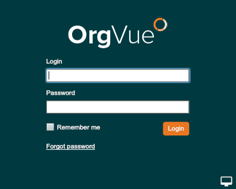

## Log in to OrgVue
1. Go to the OrgVue Demo site (https://orgvuedemo.concentra.co.uk/). Make sure you are on the latest version. The release numbers are updated by default – don’t worry.

2. Log in using your supplied username and password

3. Select the Tenant ‘ORGVUE-TRAINING-AREA’

**Notes:**
* Step 3 will be skipped when your account is registered in only one Tenant
* A ‘Tenant’ is a logically and physically-separated partition on the OrgVue server keeping your data private and secure
