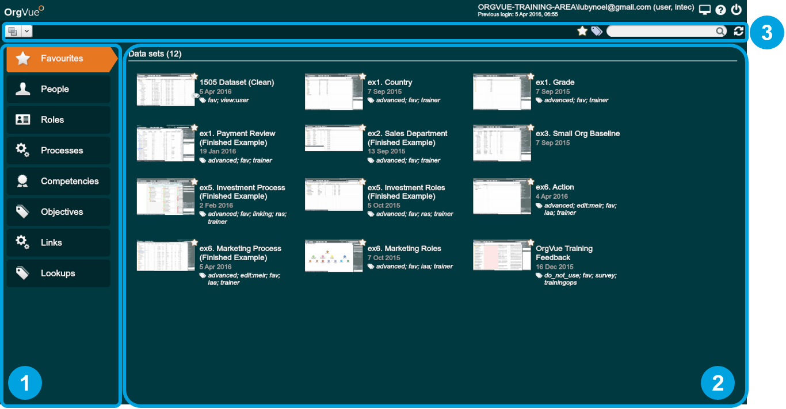
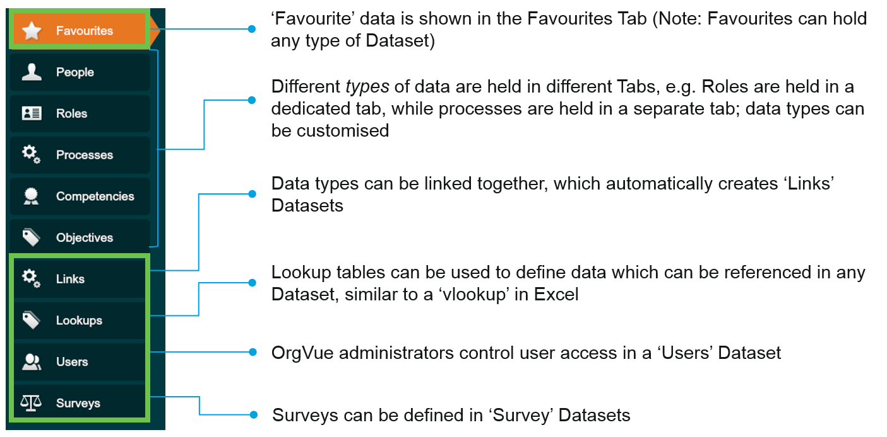
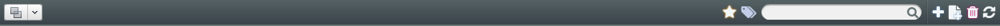
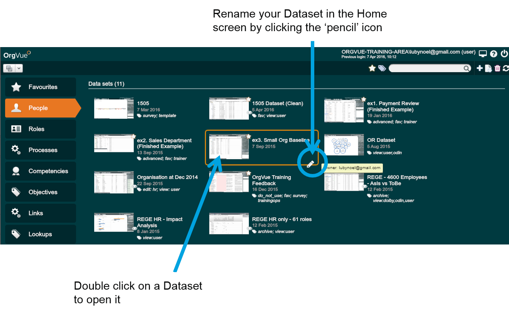
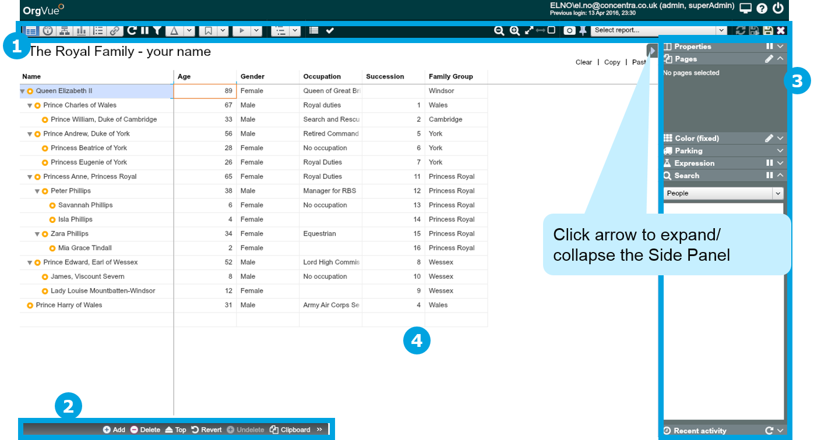
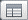
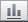

## Navigate OrgVue
### Home screen
You will land on the OrgVue Home screen. There are three areas to the Home screen; (1) Tabs, (2) Datasets and Reports, and (3) Management area.

**Note:** OrgVue users with ‘admin’ permission can access additional Tabs for account and Dataset administration.

### Home screen - Tabs
All data is held in a series of Tabs. These Tabs store files of a certain type (e.g. People, Roles), control user permissions (Users), and hold automatically generated Datasets (e.g. Links, Surveys).

**Notes:**
* Tabs in green boxes are permanent Tabs that deal with system-level issues, such as managing Favourites, Links, Lookups, User Permissions and Surveys
* Other Tabs contain different types of Datasets and are configurable by the administrator

### Home screen – Dataset management icons

You can manage your Datasets using the icons at the top on the Home screen.

| Button                 | Description                        | 
| ---------------------- |------------------------------------| 
||Click here to sort the Datasets. You can sort by name, last modified, owner, tags, and type.| 
||Click on any Dataset, then click this ‘star’ icon to make the Dataset viewable under the Favourites tab.| 
||Click on any Dataset, then click this icon to “tag” the Dataset in some way. Tagging allows you to define who can see and edit each Dataset.| 
||The Search Bar is a quick way to find specific Datasets when there are a large number of them in an OrgVue Environment.| 
||Clicking the ‘+’ icon creates a new Dataset. Click the desired Tab for the Dataset prior to clicking it.| 
||Clicking the ‘Add from template’ icon will create a new Dataset in the same format as a Dataset tagged ‘template’.| 
||Click on any Dataset, then click the ‘trash’ icon to delete it.| 
||Clicking this icon loads the latest Datasets into the Environment.| 

**Note:** You can’t create a new Dataset while in the Favourites Tab.

###Navigate OrgVue – The Dataset screen
There are four areas to the Dataset screen; (1) Toolbar, (2) Property Pane, (3) Side Panel and (4) Canvas.

### Navigate OrgVue – The Dataset screen – Toolbar

The Toolbar is used to define ‘What’ you want to see; choose from 6 data Views, filter your data, and pick the level and layout of trees.

| Button          | Description                               | 
| --------------- |-------------------------------------------| 
| |WORKSHEET VIEW: Data as a grid/list and where data is pasted in from Excel or entered directly.| 
| |DASHBOARD VIEW: Displays data in the form of various Dashboards|
| |TREE VIEW: Displays data in the form of Trees in different layouts e.g. org charts|
| |CHART VIEW: Bar charts and scatter plots|
| |PIVOT VIEW: Similar to pivot tables in Excel, useful for cross-checking & validating data|
| |LINK VIEW: is used to link two Datasets together|
| |REFRESH: refreshes the data (re-draws the current View)|
| |PAUSE/ GO: pause or play updates of data & charts after changes have been made|
| |FILTER: is used to find subsets of data, also useful for seeing numbers & percentages|
| |CALCULATE DELTA: is used to make comparisons between two Datasets|
||SELECT LABEL: is used to control which Property the special ‘Label’ Property is set to|
| |PARENT BY: is used to control which Property stores the information by which OrgVue renders hierarchies for the current Dataset|
||SHOW LEVELS: is used to limit the maximum organisation Depth rendered in the current view|
| |LAYOUT: is used to switch between Flat and Hierarchical layouts of the Dataset|

Using the icons on the collapsed Property Pane, you can add, delete and undelete the nodes, revert the changes made and copy the data out from the visuals.
Opening up the Property Pane lets you manage the properties in the dataset, and edit property values for a selected node.
