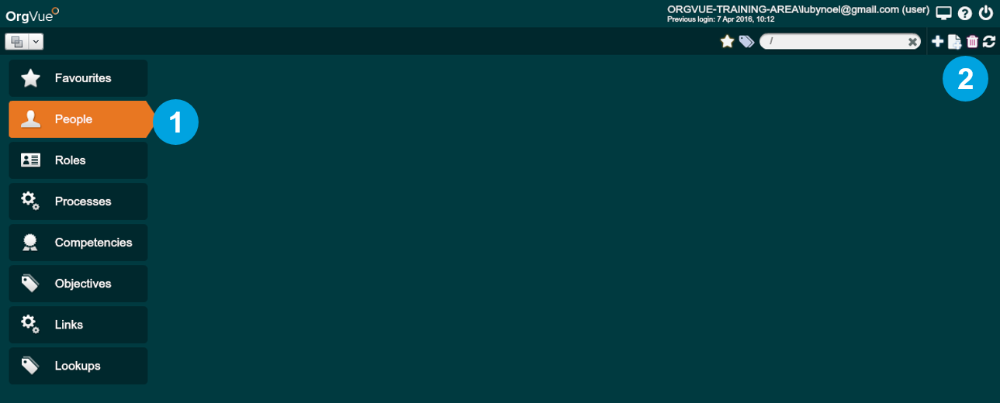
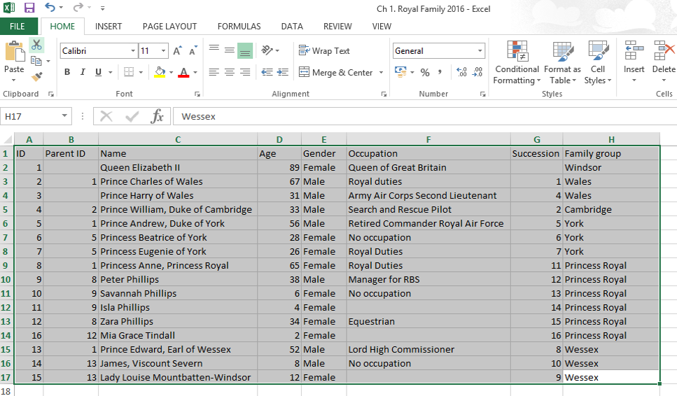
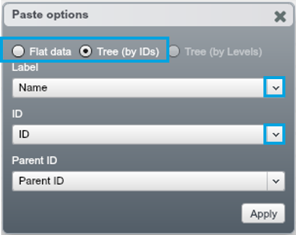
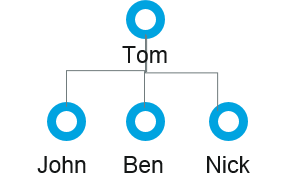
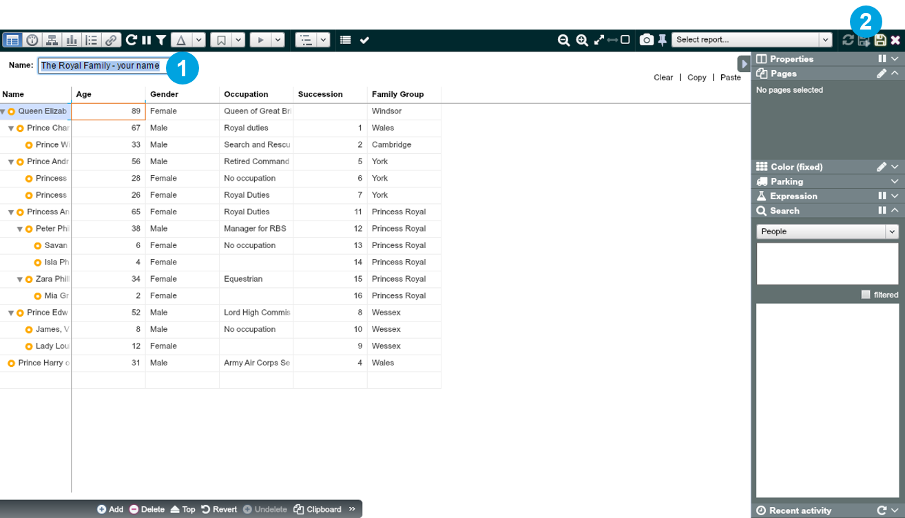

## Get data into OrgVue
### Create a new Dataset
1. From the Home screen, select the People Tab on the left
2. Click the ‘+’ icon to create a new Dataset within the Tab. You will be taken to OrgVue’s Worksheet

### Copying a Dataset from Excel
1. Open ‘Ch1. Royal Family.xlsx’ and select all rows and columns using Ctrl+A
2. Copy selected data using Ctrl+C

**Getting your data into OrgVue from Excel is as simple as Copy & Paste!**

### Paste data into OrgVue
1. Coming back to your new OrgVue Worksheet, go to the top right-hand corner and click on ‘Paste’

2. The ‘Paste data from clipboard’ Dialogue will appear. Press Ctrl+V to paste the data

### Select Paste options
1. The ‘Paste options’ Dialogue will appear. To see your data as a hierarchy, select ‘Tree (by ID’s)’
2. Choose “Name” from the ‘Label’ dropdown
3. Choose the ‘ID’ and ‘Parent ID’ in the dropdowns as below
4. Click ‘Apply’

**Notes:**
* If you choose ‘Tree (by IDs)’, OrgVue automatically builds a hierarchy based on the selected ‘ID’ and a ‘Parent ID’. Meanwhile the ‘Flat data’ option is for the dataset not in a hierarchical structure or to display hierarchical data as a flat data.
* ‘Label’ is an identifiable descriptor for each record – can be changed later, e.g. “Name”, “Role”.
* ‘ID’ is a unique identifier for each record (node), for the employees dataset normally it is “Employee ID” or “NI Number” and etc.
* ‘Parent ID’ is a property used to define hierarchical relationships between nodes, for the employee datasets it can be “Manager ID”

|Employee ID|Manager ID|Name      |
|---------|--------|----------|
|1| |Tom|
|2|1|John|
|3|1|Ben|
|4|1|Nick|

Hierarchy creation and visualisation is covered in more detail in [Chapter 3]().

### Name and save your Dataset
1. You will need to give your Dataset a name and press Enter before you can save it
2. Click on the ‘Save’ icon to save your data

**Your data is now in OrgVue!**

