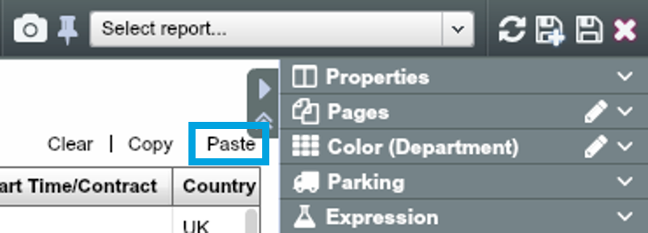

## Get data into OrgVue
### Create a new Dataset
1. From the Home screen, select the People Tab on the left
2. Click the ‘+’ icon to create a new Dataset within the Tab. You will be taken to OrgVue’s Worksheet

### Copying a Dataset from Excel
1. Open ‘Ch1. Royal Family.xlsx’ and select all rows and columns using Ctrl+A
2. Copy selected data using Ctrl+C

**Getting your data into OrgVue from Excel is as simple as Copy & Paste!**

### Paste data into OrgVue
1. Coming back to your new OrgVue Worksheet, go to the top right-hand corner and click on ‘Paste’

2. The ‘Paste data from clipboard’ Dialogue will appear. Press Ctrl+V to paste the data

### Select Paste options
1. The ‘Paste options’ Dialogue will appear. To see your data as a hierarchy, select ‘Tree (by ID’s)’
2. Choose “Name” from the ‘Label’ dropdown
3. Choose the ‘ID’ and ‘Parent ID’ in the dropdowns as below
4. Click ‘Apply’
