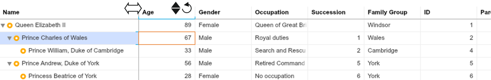
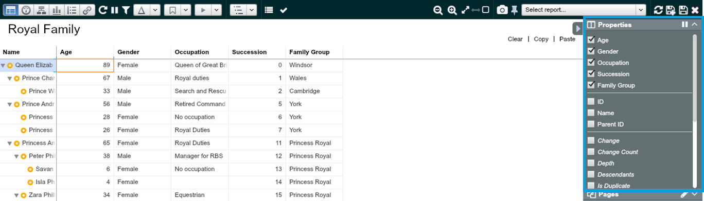

## Work with Worksheet View

### Worksheet View - Grid Control overview

In Worksheet View you can view and edit your data as you would do in Excel spreadsheets – double click on a cell and edit the value. 
Other key control options are:
-  Adjust column width by dragging the vertical line at the top row. Double-click to auto width
-  Sort data in ascending or descending order 
-  Revert all changes within the column (property)
- (hand icon) Move column orders by drag and drop the header

*These icons appear when you hover over on the column header.*

**Exercise:** Sort Royal Family members 1) by succession ranking from high to low, 2) by age low to high, 3) by gender

### Worksheet View – Property Panel 

Properties Panel on the right hand side lets you to choose the properties displayed in the Worksheet View.
 

