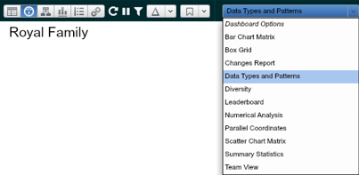
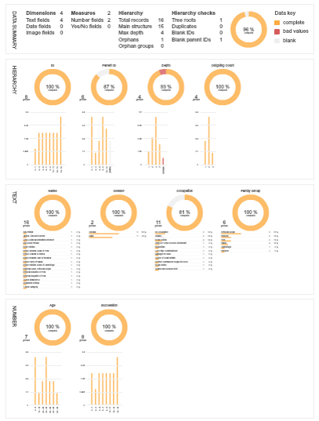

## Understand your data
### Data Types and Patterns dashboard

After getting your data in OrgVue, the first thing you would want to do is to get a grasp of data using Data Types and Patterns dashboard. 
1. Go to Dashboard View (the second button from the left) through Toolbar
2. Choose ‘Data Types and Patterns’ from the dropdown list

3. By default it shows the Data Summary and completeness of all properties. Open up the Dashboard Panel on the right-hand side and configure the setting, e.g. tick ‘Show details’ to display distribution of the values for each property

**Note:**

These 5 icons are located next to the camera icon on the Toolbar. Use these icons to 1) zoom out, 2) zoom in, 3) fit content, 4) fit width, and 5) change page orientation.

**Exercise:**
Looking at the Data Types and Patterns dashboard discuss what you’ve learned about the Royal Family dataset. 

* What is overall completeness?
* How many properties does this dataset has?
* Is there any numerical property? How about date?
* Which properties have missing values? Can you explain the reason why it’s missing? What would you do to deal with those missing ones?
* What else do you see as stand out?

