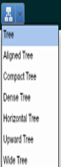
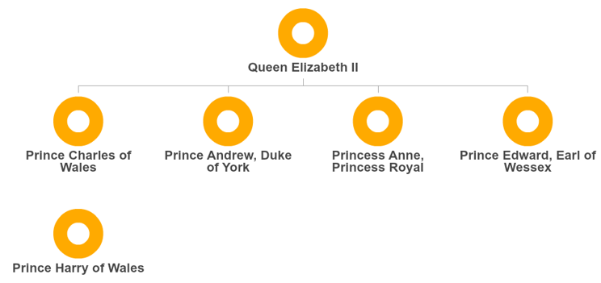
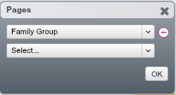
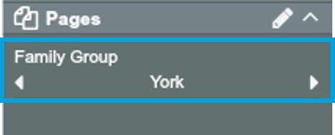
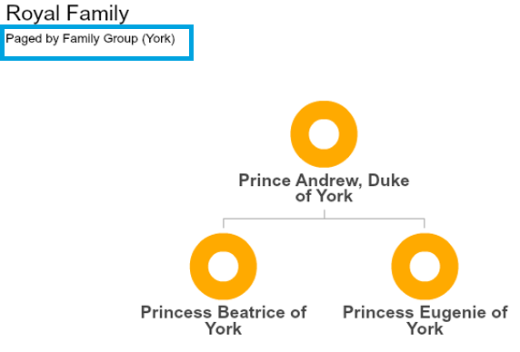

## View your data as a tree

### Navigate to Tree View
View the data as a tree by selecting Tree View in the Toolbar (top left).

Tree View and related concepts will be covered in more detail in [Chapter 3].

### Change layouts 

In OrgVue, hierarchies can be visualised in various other layouts other than traditional tree-like org chart. You can change the layout from the ‘Tree layout’ dropdown list.

**Exercise:** explore couple of layout options – Tree, Horizontal Tree, Icicle, Sunburst and Balloon and discuss how it captures hierarchical relationships and why it can be useful.

### View a subset of your data
There are multiple ways of subsetting your organisation in OrgVue.

#### 1. Subset by level 
 'Expand to level' lets you to control the level of depth you want to display. In Royal Family example, you can choose from 1 to 4. If you set it to level 2, the chart will collapse 2 levels up. 

#### 2. Paginate
You can choose a single or multiple criteria. For example, 

1. Click ‘pen’ icon on the Pages Panel
 
2. In the dialogue, choose ‘Family Group’ 

     

3. Open up the Pages Panel and click through the arrows

#### 3. Filter

**Note:** 
* Unlike the above 2 options which only change what you ‘see’, xxxx
* Paging and Filtering is applied across all views. 
* You can mix and match different methods

