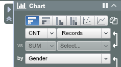
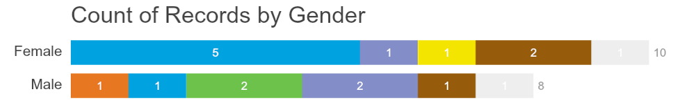

## Create a chart

To create a bar chart of count by Gender,

Step 1. Go to Chart View

Step 2. Expand the Chart Panel, then choose CNT of “Records” by “Gender”

**Exercise:**

Chart will be covered in more detail in [Chapter 5]. 

