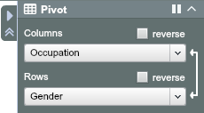
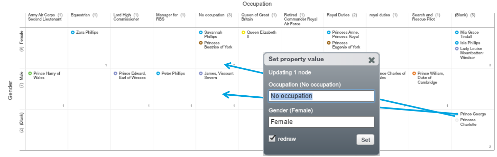

## Cleanse data using Pivot
Step 1. Go to Pivot View

Step 2. Expand the Pivot Panel, then choose “Occupation” in Columns and “Gender” in Rows

Step 3. Make corrections using ‘Drag-and-Drop’, e.g. move Prince George and Princess Charlotte into the right cells 

Pivot View will be covered in more detail in [Chapter 5].

**Exercise:**
