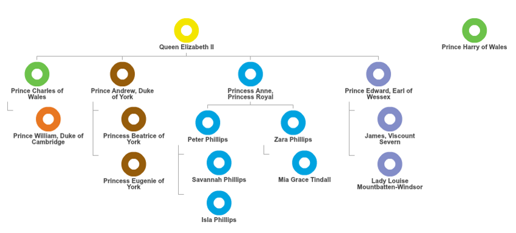

## Add colours to your Org Chart
### Colour your org chart by Dimension

1. Click the ‘pencil’ icon in the Color Panel from the Side Panel on the right

**Note:**
Can’t see it?
The Side Panel can be collapsed and expanded to allow users work with a bigger canvas.
Click the arrow  to open up the Side Panel.

2. Select ‘Dimension’ radio button then select Family Group from the dropdown to colour by it

The colours applied across all views. go back to Worksheet view and check.

**Exercises:**
Colour by measure

