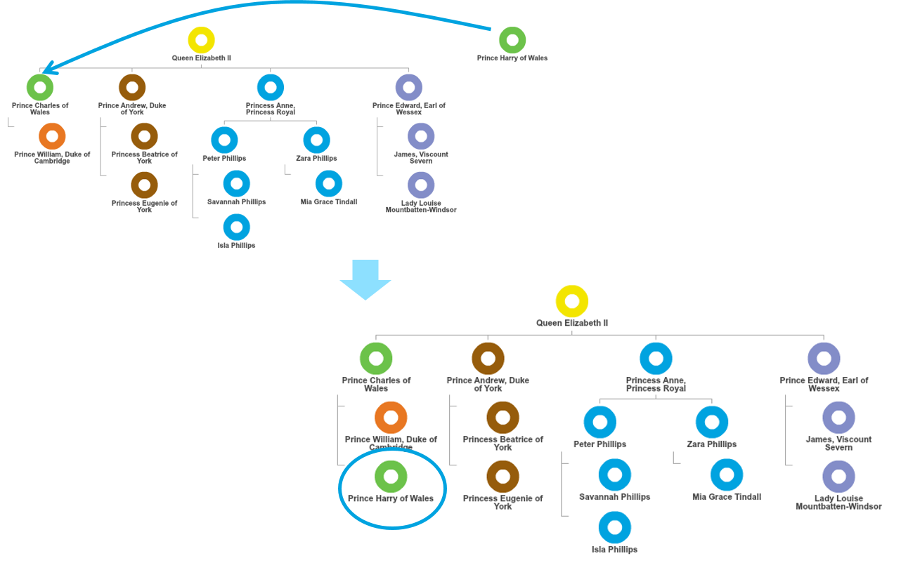
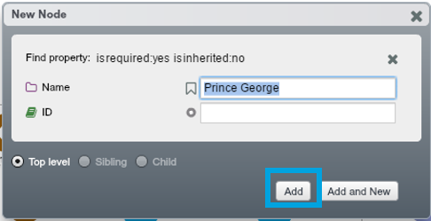
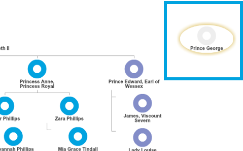
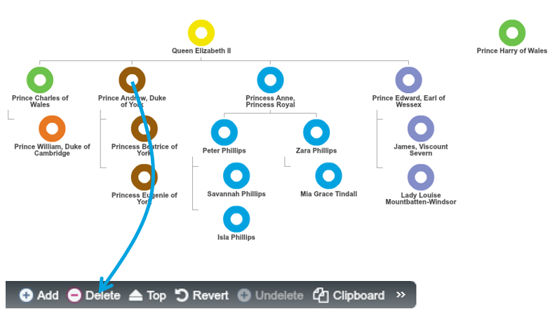
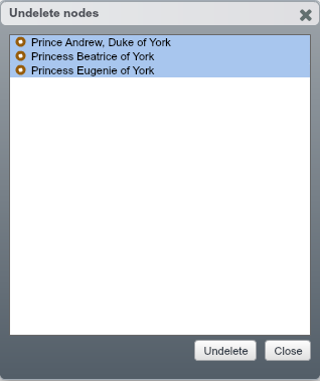

## Work with nodes

### Parent and Un-parent a node.

Drag-and-drop ‘Prince Harry of Wales’ to be the child of Prince Charles.

To un-parent, drag it to the top at the bottom.
(picture)

### Move a node

To un-do your action, click Revert.

### Add a new node

1. Click the ‘+’ icon at the bottom left to add a new node

2. Type in ‘Prince George’ in the ‘New Node’ Dialogue, then click ‘Add’

3. Drag-and-drop ‘Prince George’ to be a child of Prince William

**Exercise:**
Add Princess Charlotte to the right parent using the same method.

See [Chapter 4] to learn more about Property Pane.

### Delete and undelete a node
#### Delete a node

1. To delete a node, drag and drop the node onto the ‘Delete’ icon on the Property Pane at the bottom of the screen

2. By selecting the first option, whole York Family is deleted

#### Undelete deleted nodes

1. To undelete the nodes just deleted, click ‘Undelete’ icon on the Property Pane. This icon is activated only when there is a deleted node and unsaved

2. In the Undelete nodes dialogue, you can choose the node(s) you want to restore. In this example, select all of them and hit ‘Undelete’

3. deleted nodes (whole York Family) are back in the tree

