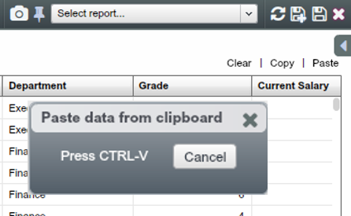
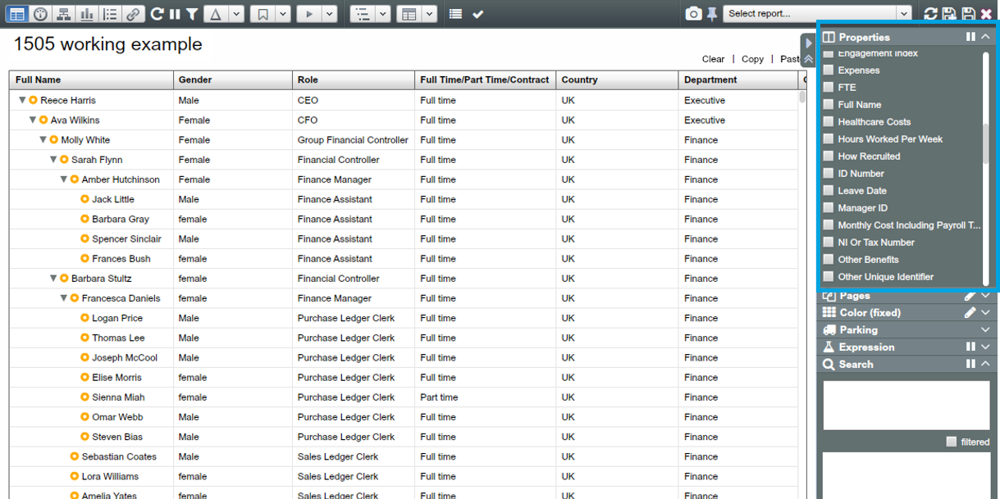
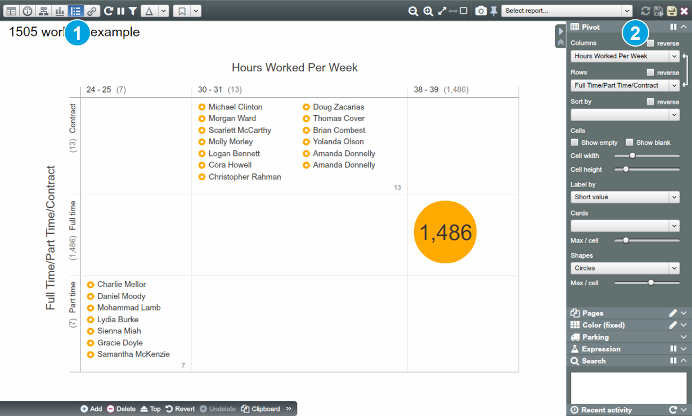

# Paste and merge data with the existing dataset

Paste merging works like a VLOOKUP in Excel, in that when you copy data into OrgVue you need to have a property common to both tables and this is the field used to merge data into OrgVue.
Check the Properties Panel in the Side Panel to check your merge was successful– the Properties Panel lets you select which properties are displayed on the Worksheet, in what order (30 max.)  

##Task: practice paste and merge using 1505 Dataset

1) Create your own 1505 Dataset using the Employee Data tab in ‘Ch2 – 6. 1505 Dataset.xlsx’ 

2) Merge the data from the ‘Hours Worked per Week’ tab with the Employee Data

Note: We will use this Dataset from chapter 2 to chapter 6.

##Create your own 1505 Dataset in OrgVue
1) Open the ‘Ch2-6. 1505 Dataset.xlsx.’ file

2) Select all data in the ‘Employee Data’ tab using Ctrl+A and copy it using Ctrl+C

3) Go to the Home screen and click the ‘+’ icon at the top right

4) In the new worksheet, click 'Paste'

5) The ‘Paste options’ Dialogue will appear. Select ‘Tree by IDs’ and set the ‘Label’ as “Full name”)

6) Check your Dataset is pasted into the Worksheet as a hierarchy. Name your Dataset <1505 – your name> and save it

**Click and see details of warning – duplicated nodes. It provides information about errors in the Dataset.**

##Paste and merge the ‘Hours Worked per Week’ data into your employee Dataset

1) Go to the ‘Hours Worked by Type’ tab in the ‘Ch2-6. 1505 Dataset.xlsx’ file. Copy all data.

2) Go to your 1505 Dataset in OrgVue. Click ‘Paste’ in the top right-hand corner
The ‘Paste data from clipboard’ Dialogue will appear. Press Ctrl+V to paste data

3) Select ‘Merge on field’ when the ‘Paste options’ Dialogue appears, then click ‘Apply’

4) Select ‘Merge on field’ when the ‘Paste options’ Dialogue appears, then click ‘Apply’

**If there are multiple properties upon which you can merge your new data into the existing Dataset, you can specify which property through the drop down list**

5) Check new data is merged into the existing Dataset in OrgVue

**Can’t see the new data in the Worksheet?
Open up the Properties Panel in the Side Panel and see that the ‘Hours Worked Per Week’ property has been added to the list. Tick it to add it to the current Worksheet View.**

##Validate merging in Pivot View

Navigate to Pivot View and see whether all values have been merged.

1) Go to Pivot View 

2) Choose “Hours Worked Per Week” as ‘Columns’ and “Full Time/Part Time/Contract” as ‘Rows’ 

#Related blog posts

[Org charts are boring – but brilliant](http://blog.orgvue.com/org-charts-are-boring-but-brilliant-3/)

