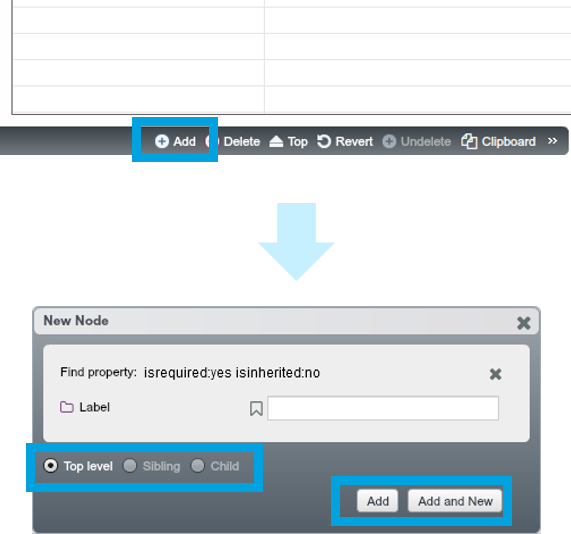
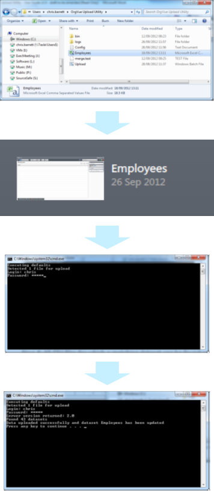
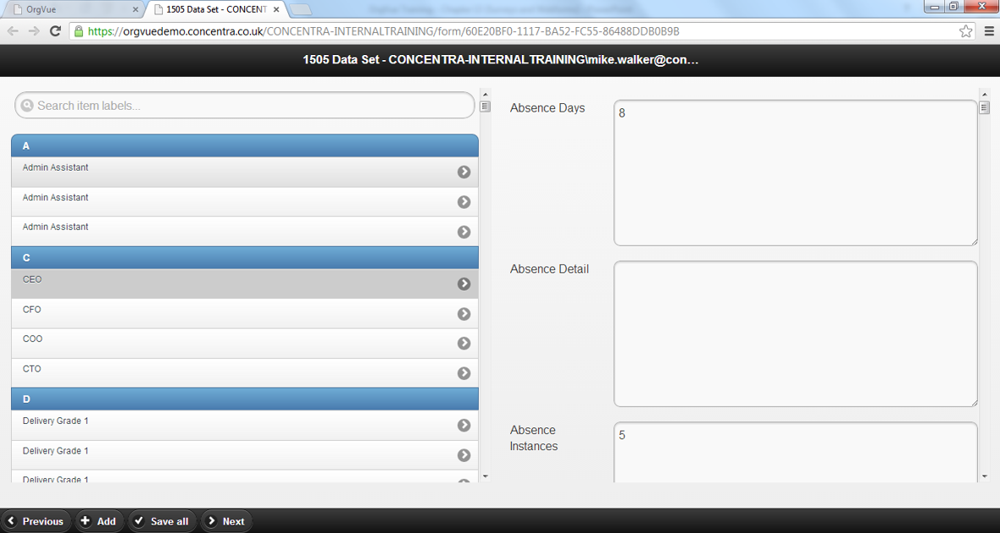
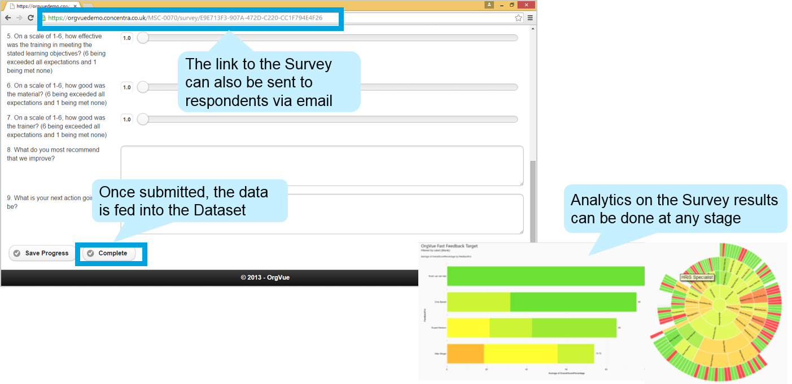
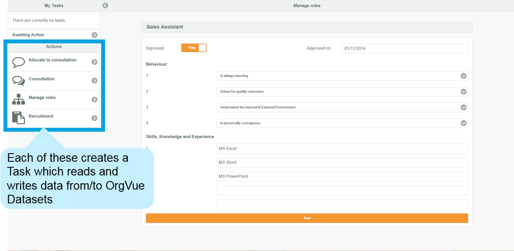

# Chapter 2. Integrating data

##There are 6 ways of entering data into OrgVue:

**Note:** Interfaces are covered in more detail in the OrgVue Blog

##The OrgVue interfaces are suitable in different situations

|| Webforms | Surveys | Tasks |
| -- | -- | -- | -- |
|  | |  | 
| What? | Online forms that allows users to update a Dataset, requires users to have an OrgVue login| Customisable surveys that can be administered via OrgVue, can be sent to anyone - response progress is tracked  | A single URL containing several bespoke apps, requires users to have access to OrgVue|
| When to use? | Useful when you want multiple users to **update** various aspects of a Dataset without logging in to Workspace | Useful when you want to gather **one-off** information from a large number of respondents and aggregate the results| Useful when you want to guide users through a **data entry process**, especially if it involves dynamic workflow/ approval|
##1. If you have data in the form of columns and rows, copy and paste it into OrgVue

###Required Excel format

* Ensure all headers are populated and ideally unique to each column
* Avoid blank columns if possible

###How-to

1. Open the Excel spreadsheet and select all rows and columns using Ctrl+A

2. Copy selected data using Ctrl+C

3. In OrgVue, go to the top right-hand corner and click the ‘+’ icon to add a new Dataset

4. In the new Dataset, go to the top right-hand corner and click ‘Paste’

5. The ‘Paste data from clipboard’ Dialogue will appear.  Press Ctrl+V to paste the data

6. The ‘Data Mapping’ Dialogue will appear.  To see your data as a hierarchy, select ‘Tree (by ID’s)’

7. Give your new Dataset a name and save it

**Note:** Importing data from Excel is one of the most common ways Datasets are created in OrgVue

##2. You can get data into OrgVue by direct entry from the Property Pane

###How-to

1. Open a blank Dataset

2. Go to the bottom of the screen and click on ‘+ Add’. The ‘New Node’ Dialogue will appear

3. Select ‘Top level’ since you have no existing data.  For consecutive people you want to add, specify whether you want to add a sibling, child or top-level node

4. Type in the ‘Label’ (“Role” in this case)

5. Click on ‘Add’ if you’re adding just one node, or click ‘Add and New’ if you’re adding more than one

* You can add new nodes in any View – it doesn’t have to be in Worksheet View
* It is not necessary to enter an ID Number when you create a new node – if you leave this blank, OrgVue will assign a unique ID Number for you

##3. Use the OrgVue Upload Utility when you want to import data from large databases

###Pre-requisites

* Data to be uploaded must be in CSV format
* The first row of data in the CSV file must contain the column headings
* The CSV file must be a contiguous block of data (continuous rows and columns) i.e. the data should have no empty rows or columns, and no subheadings or sections

**Note:** The Upload Utility can be requested by contacting support@orgvue.com

##4. OrgVue Webforms are created through a link that gives a restricted view of the Dataset (mobile & desktop compatible)

**Note:** Webforms are covered in more detail in the Advanced Training course.

##5. OrgVue Surveys feed results instantly into the Dataset and let administrators track progress live

**Note:** Surveys are covered in more detail in the Advanced Training course.

##6. OrgVue Tasks guide the user through a series of input screens and record the answers in the Dataset

**Note:** Task forms are covered in more detail in the Advanced Training course.

