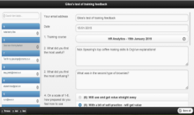

# Chapter 2. Integrating data

###There are 6 ways of entering data into OrgVue.

1) Copy and paste

2) Manual data entry

3) Auto-upload from database

4) Interactive webforms

5) Out of the box & custom surveys

6) Tasks to manage workflow

