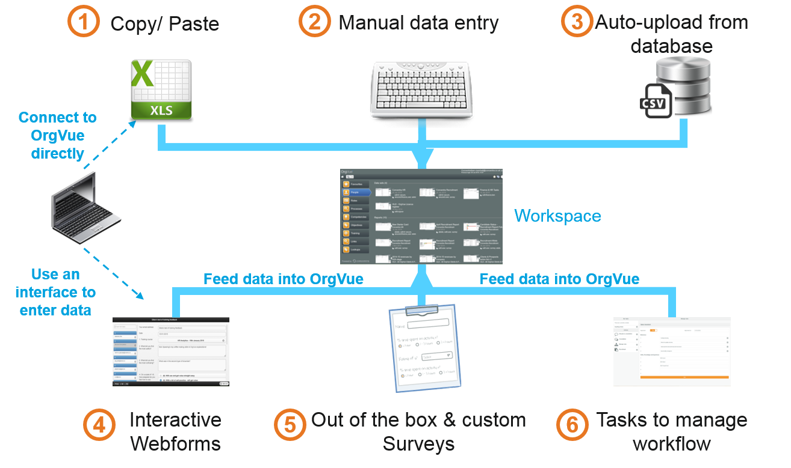
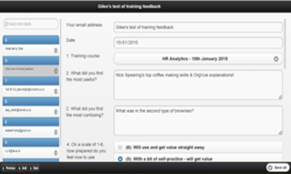
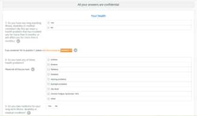
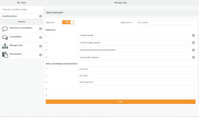
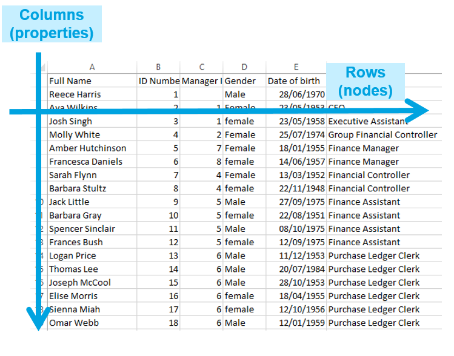

# Chapter 2. Integrating data

##There are 6 ways of entering data into OrgVue:

**Note:** Interfaces are covered in more detail in the OrgVue Blog

##The OrgVue interfaces are suitable in different situations

|| Webforms | Surveys | Tasks |
| -- | -- | -- | -- |
|  | |  | 
| What? | Online forms that allows users to update a Dataset, requires users to have an OrgVue login| Customisable surveys that can be administered via OrgVue, can be sent to anyone - response progress is tracked  | A single URL containing several bespoke apps, requires users to have access to OrgVue|
| When to use? | Useful when you want multiple users to **update** various aspects of a Dataset without logging in to Workspace | Useful when you want to gather **one-off** information from a large number of respondents and aggregate the results| Useful when you want to guide users through a **data entry process**, especially if it involves dynamic workflow/ approval
 |
##1. If you have data in the form of columns and rows, copy and paste it into OrgVue

###Required Excel format

* Ensure all headers are populated and ideally unique to each column
* Avoid blank columns if possible

###How-to

1.
Open the Excel spreadsheet and select all rows and columns using Ctrl+A

2.
Copy selected data using Ctrl+C

3.
In OrgVue, go to the top right-hand corner and click the ‘+’ icon to add a new Dataset

4.
In the new Dataset, go to the top right-hand corner and click ‘Paste’

5.
The ‘Paste data from clipboard’ Dialogue will appear.  Press Ctrl+V to paste the data

6.
The ‘Data Mapping’ Dialogue will appear.  To see your data as a hierarchy, select ‘Tree (by ID’s)’

7.
Give your new Dataset a name and save it

**Note:** Importing data from Excel is one of the most common ways Datasets are created in OrgVue

