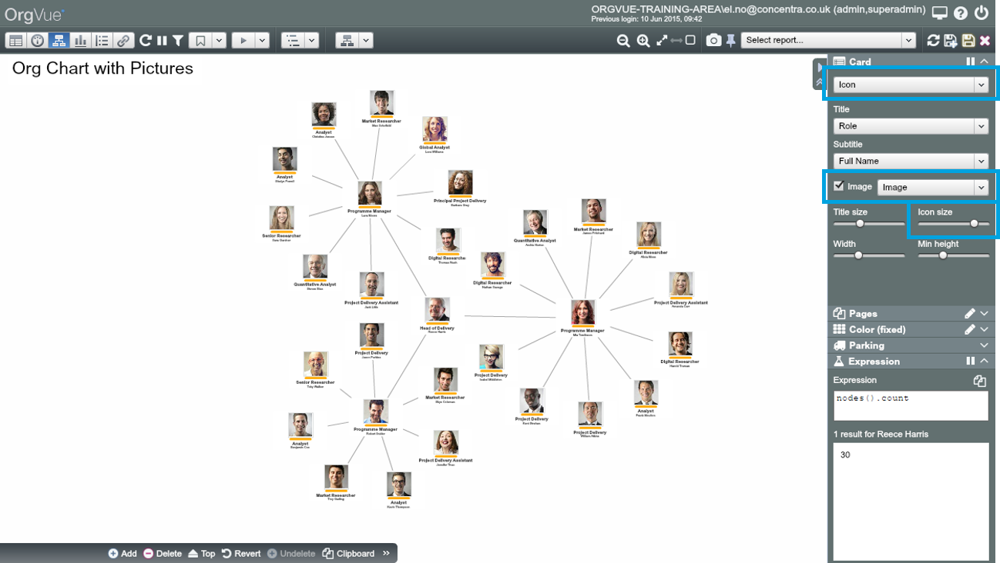

##How-to guide: Add pictures to your org chart

###Uploading pictures

1. Prepare the pictures of employees in a single zip file (no subfolders)

  *   **File type and size:** pictures work best in passport format, ideally around 10K per image in .PNG or .JPG

  * 
  **File name:** the images should be named to match the values of a property in your Dataset. For example, if you named each image with the employee names, you could then merge the images on the employee names in your Dataset

2. Create a property of type ‘Image’ then click on the ‘Upload zip’ button

3. Choose the property to match (merge) on, then when the ‘Upload images’ Dialogue appears click ‘Apply’ 

4. Uploaded images will be scaled automatically based on the Size setting

###Displaying pictures

1. Choose either ‘Icon’ or ‘Summary’ card

2. Check ‘Image’ then choose the property storing the image files 

3. You can enlarge and reduce the size of images displayed using the ‘Icon size’ slider

