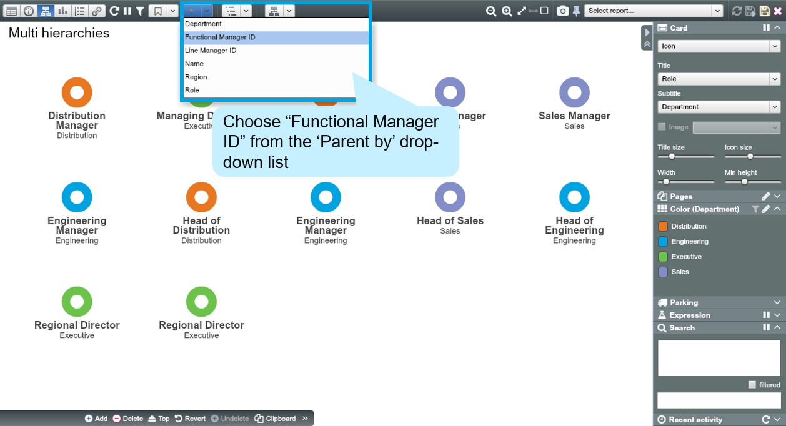
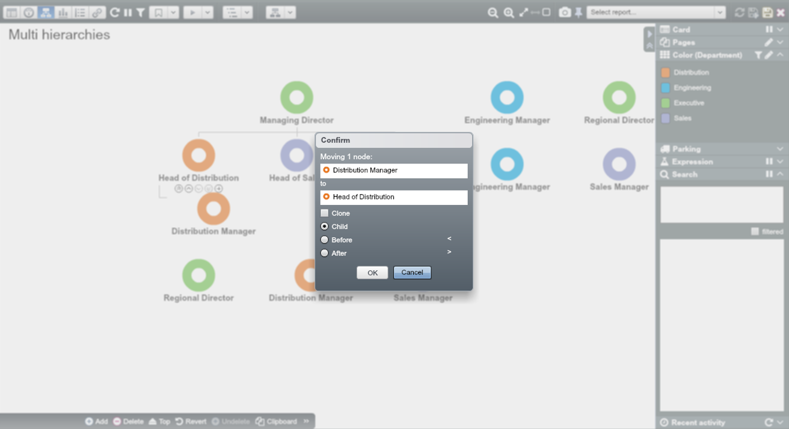
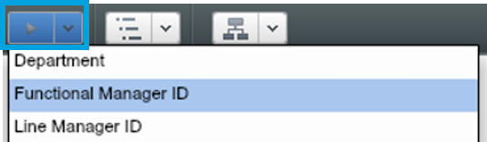
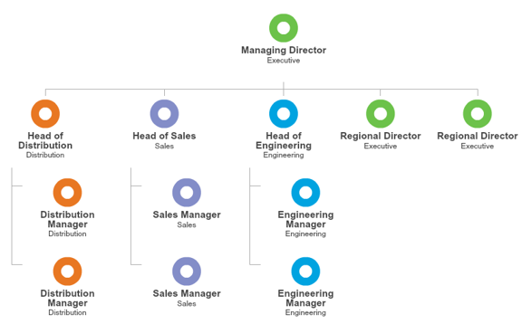

# Multiple Hierarchies

##Practice Overview

It is common to have multiple hierarchies in organisational data, e.g. matrix reporting. In OrgVue you can set up and view multiple hierarchies in the same organisation. The alternative hierarchies share the same primary key (e.g. “Employee ID”), but have a different parent key (e.g. “Functional Manager ID”).

In the example organisation ‘Ch3. Multiple hierarchies.xlsx’, the current reporting structure is Region-based. Let’s add additional reporting lines that are Function-based.

##Create a new Dataset using copy/ paste

1.
Open the ‘Ch3. Multiple hierarchies.xlsx.’ file and copy all data

2.
In OrgVue, create a new Dataset and paste the copied data

3.
When the ‘Paste options’ Dialogue appears, select ‘Tree (by IDs)’, Label by “Role”, choose “Employee ID” as ID and “Line Manager ID” as Parent ID

2. Choose ‘Icon’ card and select “Role” as Title and “Department” as Subtitle

3. Colour by “Department”

4. Set up a function-based hierarchy by dragging and dropping the nodes and re-parenting them

5. Switch to Worksheet View and find that “Functional Manager ID” has been populated with values (IDs)

##Switching between hierarchies

You can switch back to the original region-based hierarchy by choosing “Line Manager ID” from the ‘Parent by’ drop-down list.

**Functional hierarchy view:**

**Geographical hierarchy view:**

Coloured by Department (Executive, Engineering, Distribution and Sales)

For more information about handling multiple hierarchies, go to [support.orgvue.com](support.orgvue.com)

