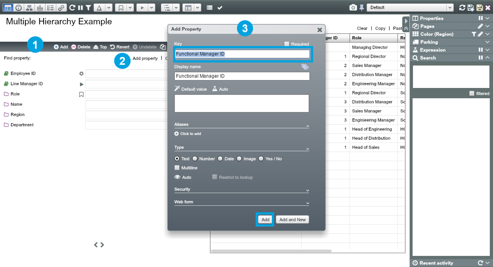
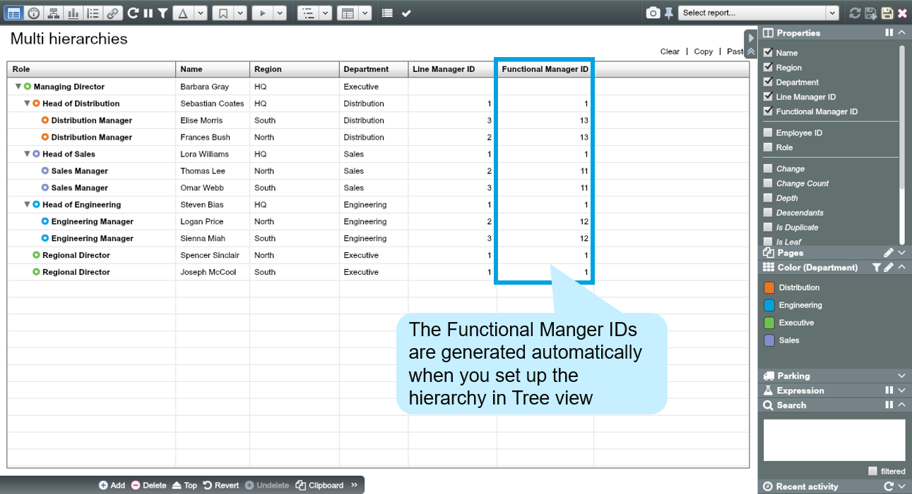
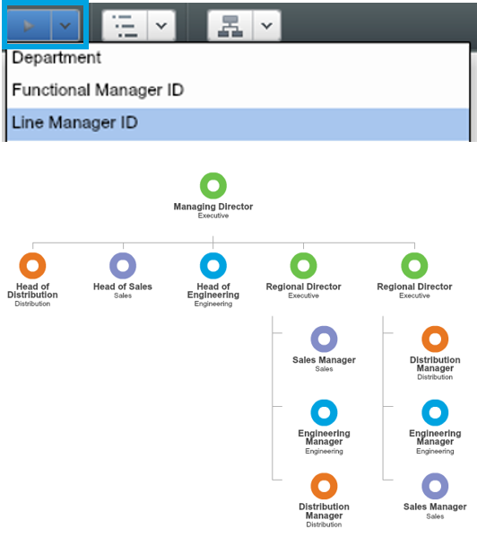
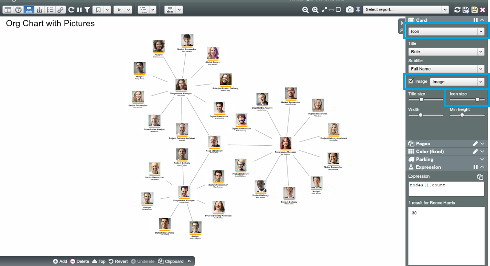

# Multiple Hierarchies

##Practice Overview

It is common to have multiple hierarchies in organisational data, e.g. matrix reporting. In OrgVue you can set up and view multiple hierarchies in the same organisation. The alternative hierarchies share the same primary key (e.g. “Employee ID”), but have a different parent key (e.g. “Functional Manager ID”).

In the example organisation ‘Ch3. Multiple hierarchies.xlsx’, the current reporting structure is Region-based. Let’s add additional reporting lines that are Function-based.

##Create a new Dataset using copy/ paste

1) Open the ‘Ch3. Multiple hierarchies.xlsx.’ file and copy all data

2) In OrgVue, create a new Dataset and paste the copied data

3) When the ‘Paste options’ Dialogue appears, select ‘Tree (by IDs)’, Label by “Role”, choose “Employee ID” as ID and “Line Manager ID” as Parent ID

##View the current reporting structure

1) Go to Tree View and choose ‘Icon’ card and select “Role” as Title and “Region” as Subtitle

2) Color by “Region”. The current reporting structure is based on region

##Add a new property containing alternative Parent ID

1) Open up the Property Pane at the bottom left by clicking on it

2) Click on ‘Add property’

3) In the ‘Add Property’ Dialogue, type in property name “Functional Manager ID” then click ‘Add’

##Build an alternative hierarchy

1) In Tree View, switch ‘Parent ID’ from “Line Manager ID” to “Functional Manager ID” (your nodes will become orphans)

2) Choose ‘Icon’ card and select “Role” as Title and “Department” as Subtitle

3) Colour by “Department”

4) Set up a function-based hierarchy by dragging and dropping the nodes and re-parenting them

5) Switch to Worksheet View and find that “Functional Manager ID” has been populated with values (IDs)

##Switching between hierarchies

You can switch back to the original region-based hierarchy by choosing “Line Manager ID” from the ‘Parent by’ drop-down list.

**Functional hierarchy view:**

**Geographical hierarchy view:**

Coloured by Department (Executive, Engineering, Distribution and Sales)

For more information about handling multiple hierarchies, go to [support.orgvue.com](support.orgvue.com)

##How-to guide: Add pictures to your org chart

###Uploading pictures

1) Prepare the pictures of employees in a single zip file (no subfolders)

* 
  **File type and size:** pictures work best in passport format, ideally around 10K per image in .PNG or .JPG

* 
  **File name:** the images should be named to match the values of a property in your Dataset. For example, if you named each image with the employee names, you could then merge the images on the employee names in your Dataset

2) Create a property of type ‘Image’ then click on the ‘Upload zip’ button

3) Choose the property to match (merge) on, then when the ‘Upload images’ Dialogue appears click ‘Apply’ 

4) Uploaded images will be scaled automatically based on the Size setting

###Displaying pictures

1) Choose either ‘Icon’ or ‘Summary’ card

2) Check ‘Image’ then choose the property storing the image files 

3) You can enlarge and reduce the size of images displayed using the ‘Icon size’ slider

