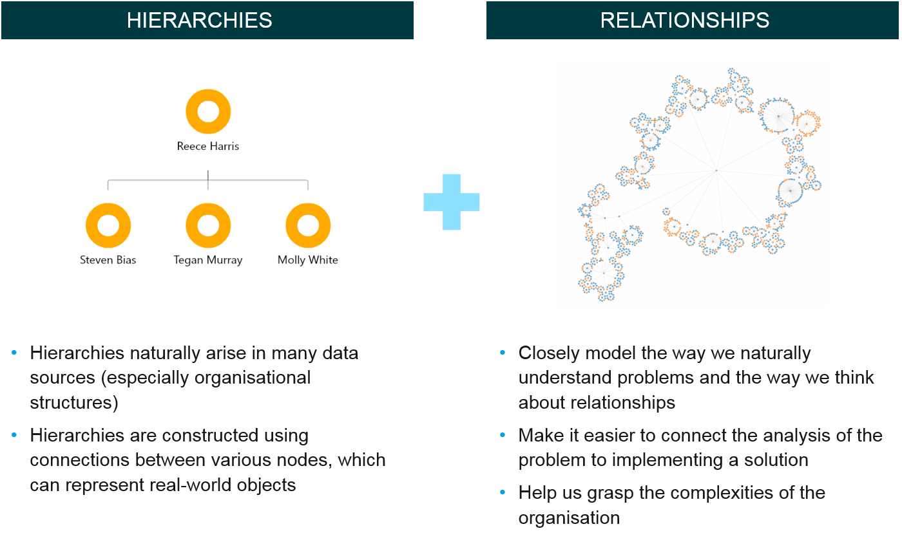
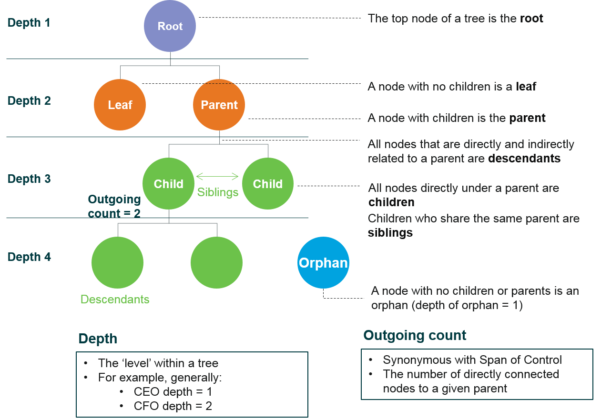

# Chapter 3. Working with hierarchical data

##The magic of OrgVue lies in its data paradigm

###Hierarchies (trees) have a well-defined vocabulary which is honoured throughout the OrgVue product

