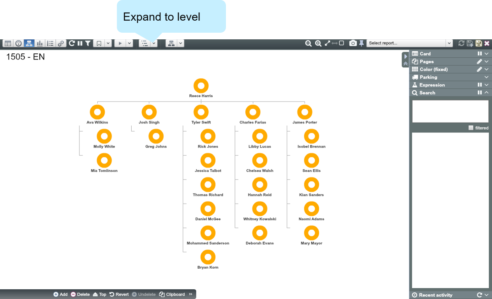
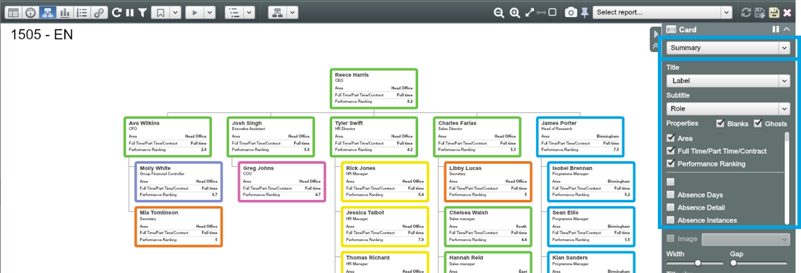

# Tree View

##Expand to level

Navigate to Tree View. We can’t see much detail in the current View. So let’s start off making things more manageable by filtering to Level 3.

Now it is much manageable. The ‘Expand to level’ dropdown lets you expand and collapse the tree to the selected Depth.

#Colour by

1. Apply colouring using the Color Control (colour by “Department”)

  

  **The colour scheme you apply in the Side Panel applies to all views.**

2. Hovering over a department in the Side Panel will highlight that department in the Tree

##Summary Card

1. Open up the Card Panel in the Side Panel and choose the card type depending on the type of data you want to highlight. In this example, ‘Summary’ card has been selected. Summary card is useful when you want to display multiple properties for each node. (NB ‘Icon’ is the default card type)

2. Choose ‘Title’, ‘Subtitle’ and other properties you want to show on cards

##Scaled Card

1. Now choose ‘Scaled’ card from the dropdown list

2. Choose a ‘Title’, ‘Subtitle’ and ‘Size by’ to configure the Scaled card as you want. Scaled card helps to give a sense of proportion within the familiar org chart picture

##Tree layout

OrgVue helps you represent hierarchical structures in your data in efficient and beautiful ways. Try different layouts using ‘Tree layout’ dropdown.

##Zoom in & out

OrgVue makes it easy to see as much detail as you need.

* 

You can also move the Tree vertically and horizontally by left-clicking the screen and dragging anywhere in the canvas

* You can also zoom in or out using the mouse wheel

##Change reporting structure using Drag-and-Drop

Simply Drag and Drop a node or group of nodes to make changes to your tree. 

Executive Assistant currently reports to CEO. Now you want to make Executive Assistant and all their descendants report to CFO.

1. Drag the Executive Assistant and drop onto CFO (waiting until the red ‘x’ by the cursor is gone)

  

2. When the ‘Confirm’ Dialogue appears, click ‘OK’ to make Executive Assistant (and their descendants) a child of CFO

  

3. Now Executive Assistant (and their reports) reports up through the CFO

##Drill through hierarchies in Tree View
1. Expand to just Level 1

2. When you hover the mouse over a node 5 icons will appear underneath it

3. Drill down the hierarchy 1 level by clicking 

|Button|Function|
|---|---|
|  | Roll back all descendants, only the CEO node will be shown|
|  | Roll up one level at a time in the tree|
|  | Roll down one level at a time in the tree|
|  | The entire organisation will be shown (full tree expansion) |
|  | Clicking this will bring up ‘New Node’ Dialogue|

##Exercise 1: Create the visuals described below in Tree Vie

1. In Tree View, set your data to ‘Level 3’. Then, create a view that shows the organisation **Scaled by**: 
  
  a) “Total Payroll Cost”

  then

  b) “Span of control” (select *“Outgoing Count”*)

2. Show the whole of your organisation as a **Sunburst** coloured by “Performance Ranking”

3. Show the top 2 Levels of the organisation with a **Summary card** with the following properties (in the same order), and coloured by “Absence Days”

* Title: “Role”

* 
Subtitle: “Department” 

* 
Other Properties: “Full name”, “Gender”, “Grade”, “Current Salary”, “Performance ranking”

##Answer 1.1:

**Hint**: Level 3, Tree layout, Scaled card, Size by “Total Payroll cost” and then after by “Outgoing count”

##Answer 1.2:

**Hint**: Level 9, Sunburst layout, Colour by ‘Measure’ and “Performance ranking”, select a palette showing RAG status

##Answer 1.3

**Hint**: Level 2, Tree layout, Summary card, display “Role” as title, “Department” as subtitle, tick “Full name”, “Gender”, “Grade”, “Current Salary”, “Performance ranking” from the list. Colour by “Absence days”

##Exercise 2: Make corrections to the reporting structure

1. Set Tree View to only look at the first 3 Levels and view as a ‘Compact’ tree (don’t forget to Refresh the data if necessary)

2. Set the Card to ‘Icon’ and the subtitle to “Role”

3. Colour the nodes by the Dimension “Department”

4. Do you notice anything not quite right in the reporting structure? Re-order or re-parent any irregularities observed

##Answer 2:

Notice that COO incorrectly reports to the Executive Assistant – Make COO report to CEO by Drag-and-Drop.

Now COO reports to CEO.

