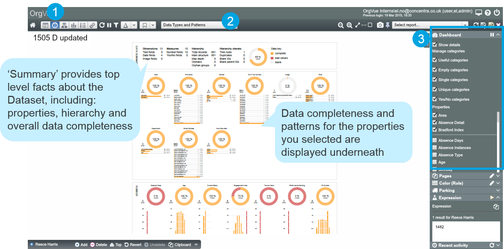

# Data Types and Patterns

##View ‘Data Types & Patterns’ Dashboard

1) Go to Dashboard View

2) Choose the ‘Data Types and Patterns’ Dashboard from the dropdown list

3) From the Dashboard Panel in the Side Panel, tick the properties you want to display on the Dashboard

