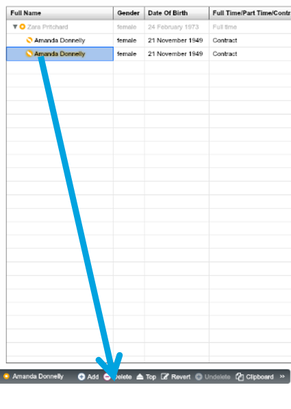

# Exercises

##Exercise 1: Use the Filter Control to complete tasks below

1. Use the Filter Control to find the percentage split of Gender in the Dataset (tip: If you have not done so, clean the gender data by ‘painting with data’ in the Filter Control)

2. Use the Filter Control to delete the duplicate node (tip: use Metadata filters)

##Answer 1.1:

Filter on “Gender” and click the ‘%’ button to show 57.9% male and 42.1% female.

##Answer 1.2:

1. 
Filter using the ‘Is Duplicate’ metadata property to highlight the duplicates

2.
Drag the duplicate node onto ‘Delete’ on the Property Pane

##Exercise 2: Use Filter Control and Splash Command to complete the task below:

1. Merge the data from the ‘Organisation Revenue by Area’ tab in the “1505 Dataset.xlsx” Excel file. Has the data all been merged correctly?

   a) Use the Filter Control to see what’s wrong (tip: check the “Revenue” property)

  b) Correct the data formats in Excel and try pasting in again. Does the data look as expected now? (tip: change the property type to ‘Number’ as well)

2. There are 5 nodes in an Area without a “Revenue” value. Use the Filter Control and splash command to set these all to 50000

##Answer 2.1:

1. Filtering on “Area” and “Revenue” shows different counts of nodes, so not all values merged

2. The data has gone in as a text value because of the different formats in the source Excel file. Fixing the Revenue values to have the same format (numbers) before merging will fix the problem

##Answer 2.2

1.
Filtering on “Area” and “Revenue” and selecting “Glasgow” will highlight five nodes with no Revenue assigned to them

2.
Apply the filter and use a splash command (50000!*) in Worksheet View to set the Revenue as 50,000

