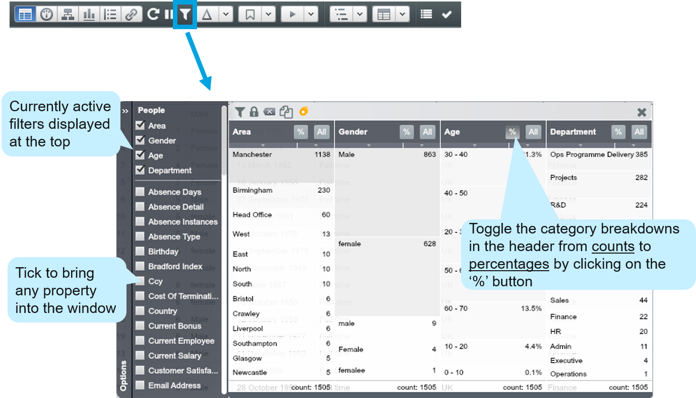

# Filter Control

##Introduction

The Filter Control lets you apply sophisticated filters to your data throughout all active Views in OrgVue.

##Apply a filter

1. You can filter your data by left-clicking once on any category in any filter column in the main window

2. Note that this filters down the number of records from 1,505 (the number of total employees) to 1,138 (the number of employees located in Manchester)

3. Notice that the number of employees under the remaining filter columns of “Gender”, “Age” and “Department” have also updated

##Apply multiple filters

The Filter Control helps you to answer complex questions, because the data within the filter is dynamically responsive.

1. We have now applied two filters simultaneously to our data – filtering by employees located in Manchester and in the Projects Department

2. The remaining values under the “Area” property Filter disappeared - this quickly tells us the entire Projects Department works only in Manchester 

##Apply or disregard filtering choices

Once you are happy with your filtering choices you can choose from one of the following options through the icons located at the top of the Filter Control.

| Icon | Function |
| -- | -- |
|  | Applies your current filters to your Dataset, which will be pushed through to all of your Views
 |
|  | Clears all your current filters but keeps you in the Filter Control window
 |
|  | Click on the padlock icon to switch modes: when unlocked, filters are automatically applied to your Dataset
 |
| | Copy the data filter(s) applied
 |
| | Use this icon to drag all nodes in the current filter(s) for further actions, e.g. cleansing, assigning new values and etc.
 |

##Before and after applying filters in Tree View 

1. In Tree View, open up the Filter Control window

2. Bring “Area” and “Department” properties into the window

3. Click Manchester from the “Area” column and click Projects from the “Department” column

4. Click the ‘Apply filter’ icon and see how the Tree changes

##Metadata filters

It is always possible to filter by a Metadata property in the Filter Control as they are not Dataset-dependant. 

###List of metadata properties:

* *Change* – Lets you filter to data that has been changed since last save
* *Change Count*– Filter by the number of times the data has been changed since the last save
* *Depth* – Lets you filter by the number of levels down from the top node in the hierarchy
* *Descendants* – Lets you filter to all the nodes beneath a given node in the hierarchy
* *Is Duplicate* – filters duplicate nodes
* *Is Leaf* – filters nodes that are leaves (i.e. have no children)
* *Is Orphan* – filters nodes that have no connections to other nodes
* *Level ‘n’* – filter by Level ‘n’ in the hierarchy
* *Outgoing Count* – synonymous with “Span of Control”
* *Parking Lot* -  filters nodes that have been dragged into a Parking Lot
* *Records* – allows you to filter by the number of records each node represents

