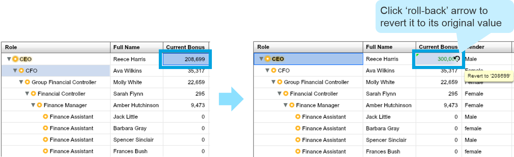
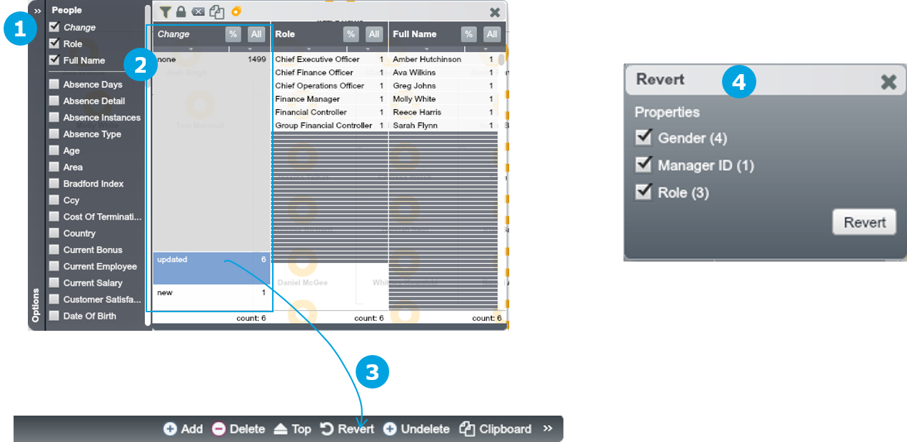

# Learn more: Undo changes

##Roll-back arrow

1. Data points which have been recently changed will be coloured Green

**Changes are only tracked since the last save operation and each time you save all data points are re-coloured black.**

2) If you hover over any green data point the **roll-back arrow** will appear

3) Clicking the ‘roll-back’ arrow will un-do the edit on that cell and revert it to its original value

**‘Un-Do’ functionality references a cell’s original value relative to the last time you saved your Dataset.  Therefore, when you save your Dataset you can no longer ‘Un-Do’ changes within Workspace. OrgVue shall retain the history of all saved changes, which can be accessed from the audit log**

##Selected changes

1) Open up the Filter Control and tick the “Changes” metadata property from the list

2) You will see the nodes are categorised by type of changes (e.g. “none”, “updated”, “new”) made since last save

3) Select one category and drag it to ‘Revert’ in the Property Pane

4) The ‘Revert’ Dialogue will appear and allow you to select the properties for which you want to un-do changes. The changes will be un-done once you click ‘Revert’

