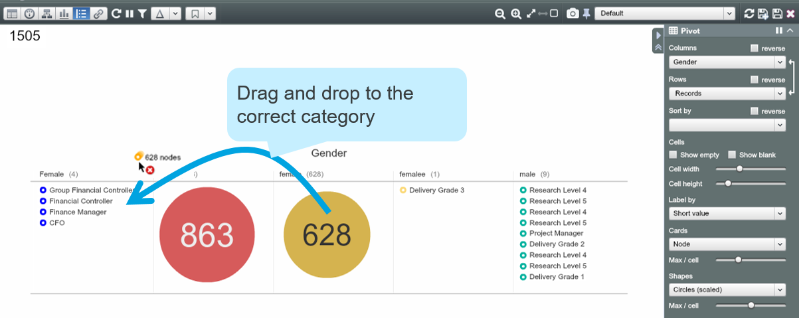

# Paint with data

##Filter control

The Filter Control is also a powerful tool to edit multiple nodes at once simply by Drag-and-Drop.

1. The Filter Control helps us identify that the “Gender” property contains 5 categories  needs cleaning!

2. Drag nodes in “female” category and drop onto “Female” category

3. When the ‘Set property value’ Dialogue appears, confirm by clicking ‘Set’

You can drag and drop from one property column to another – allowing you to truly ‘Paint’ with your data!

You can also create a new category within the property by drag-and-drop. 

##Pivot view

Drag-and-Drop in Pivot View makes data cleaning easy and playful.

1. Go to Pivot View

2. In the Side Panel, set ‘Columns’ as “Gender” and ‘Rows’ as “Records”

3. Check categories in “Gender” and identify where to clean

4. Cleanse data by dragging the nodes from the wrong category and dropping them onto the right category, in this example from “female” to “Female”

##Splash Command

Splash Commands (!) are useful for performing mass updates across filtered sections of your Dataset. 

In the example, there are two different forms indicating the same country – “UK” and “United Kingdom”. You want to set “UK” as the country for everyone in the organisation. 

1. Double-click the cell for the top node in the “Country” property and type UK!*

2. All non “UK” values in the “Country” property have changed to “UK”

* **Use the !* ending to copy a value down for each node within the filtered subset**

* **Use the !a* (e.g. UK!a*) ending to splash values to all, overriding the current filters**

* **In the Filter Control tick *‘Changes’*  to see which nodes have been changed after Splashing**
