# Property Pane

##Delete nodes

1.
To delete a node, select a node in any view and click on the ‘- Delete’ icon at the bottom of the screen or drag a node onto it

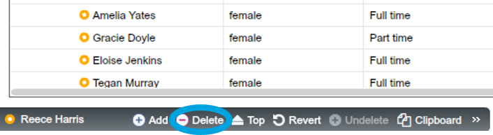

2-1. If you’re deleting a node with no children, just click ‘OK’ 

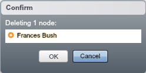

2-2.
If you’re deleting a node with children, select one of the three options, then click ‘OK’

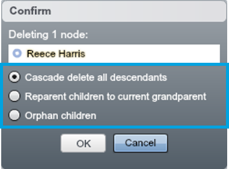

| Option | Function |
| -- | -- |
| ‘Cascade delete to all descendants’ | All descendants will be deleted along with the person | 
| ‘Reparent children to current grandparent’ | The deleted person’s direct reports will now report to his/her manager | 
| ‘Orphan children’ | The deleted person’s direct reports will now report to his/her manager | 

**Adding and deleting nodes through the Property Pane is possible in any View**

**If you delete a person (node), all data relating to that person will be deleted as well**

##Edit data

The Property Pane provides a way of editing data node by node.

1.
To open Property Pane, click the arrows on the right-hand corner or the area marked 

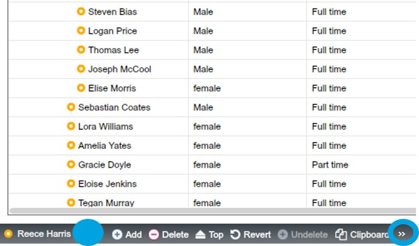

2.
Property Pane shows the list of properties and values for the selected node (employee) 

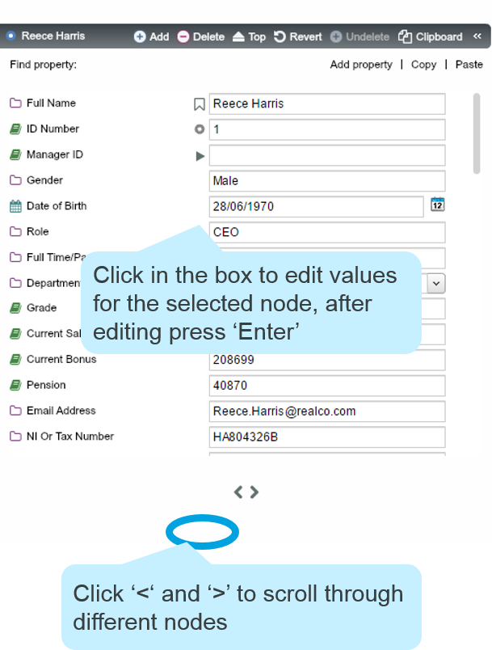

##Edit Property

You can manage settings for each property using the Property Pane.

1.
Hover your cursor over a Property and a ‘cog’ icon appears – click on this to bring up the ‘Edit Property’ Dialogue
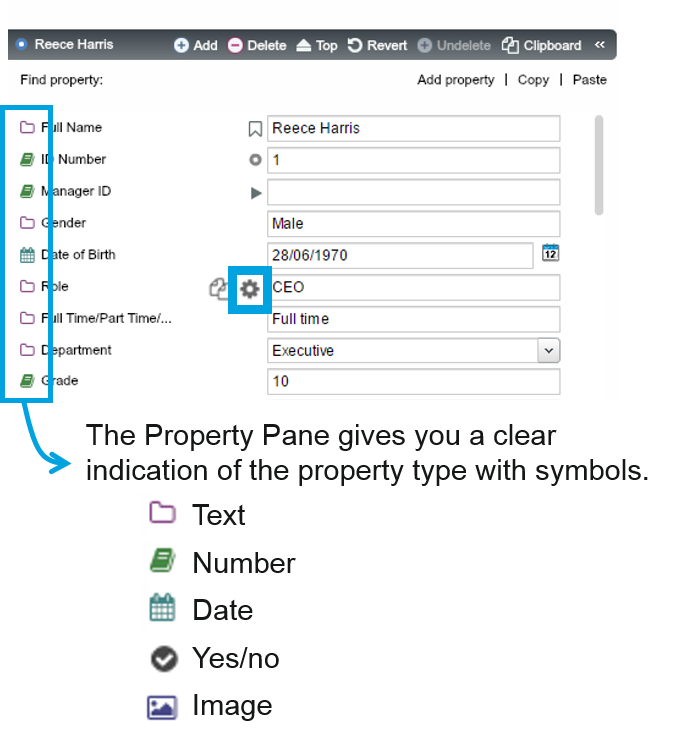

2.
In the ‘Edit Property’ Dialogue, you can change property settings or delete the property

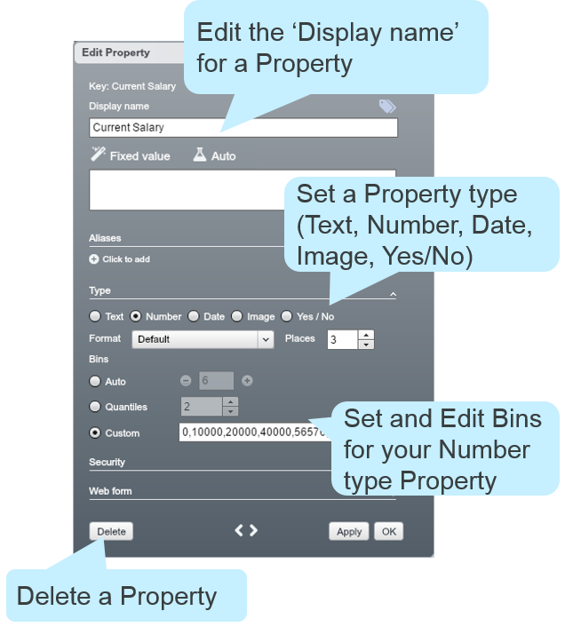

**Property settings will be covered in detail in [Advanced Training](https://www.orgvue.com/sites/default/files/uploads/orgvue_advanced_training_syllabus.pdf)**

###Edit number of bins

1.
Open the ‘Edit Property’ Dialogue through the Property Pane

2.
Under ‘Type’ select ‘Number’ to view the current Bin logic for the Property

3.
Alter the number of intervals using the ‘+’ and ‘-’ icons. Additionally, you can set quantiles or define completely customised Bin intervals for the Property

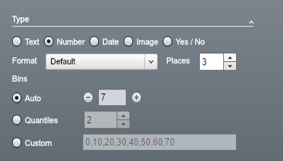
4. 
OrgVue automatically cascades your Bin logic changes to all visualisations referencing the particular Property

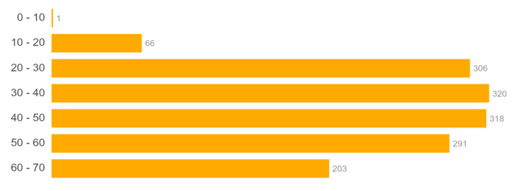
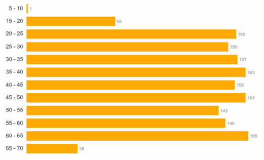

##Add new property

1.
Click ‘Add property’

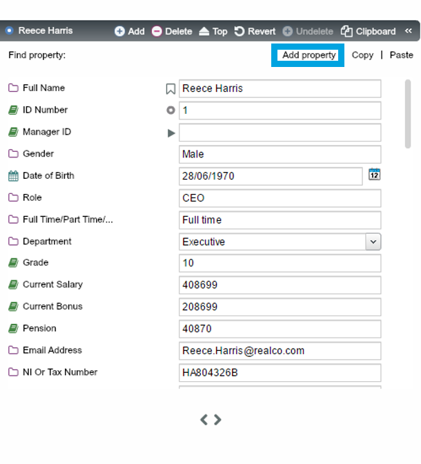2. Set parameters for new property in the ‘Add Property’ Dialogue, then click ‘Add’

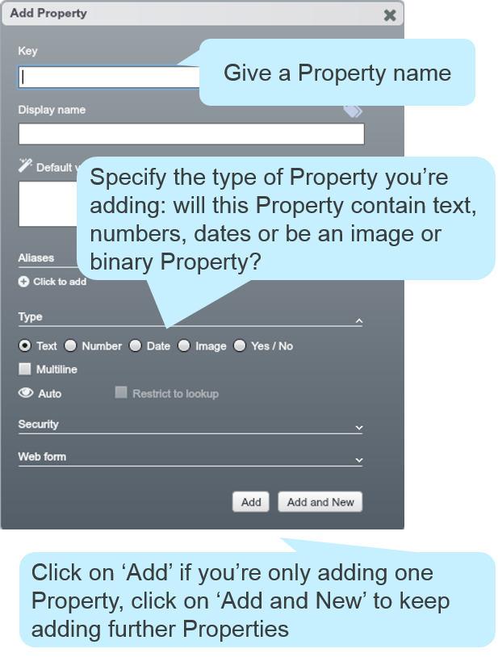

