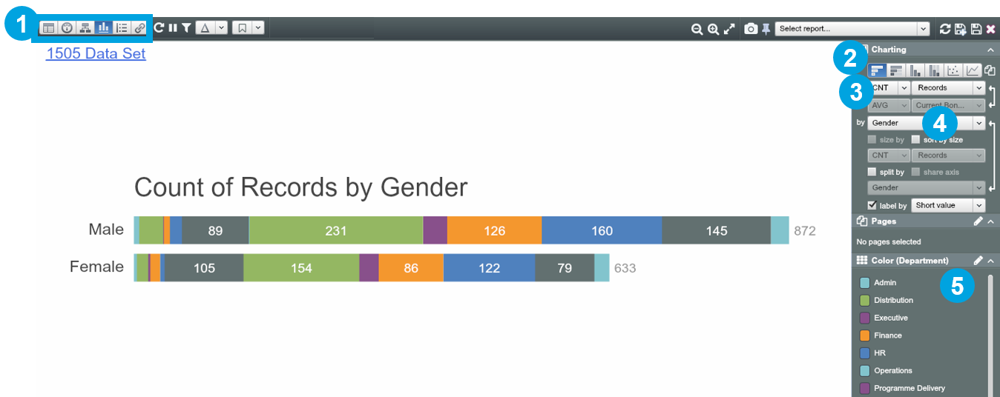
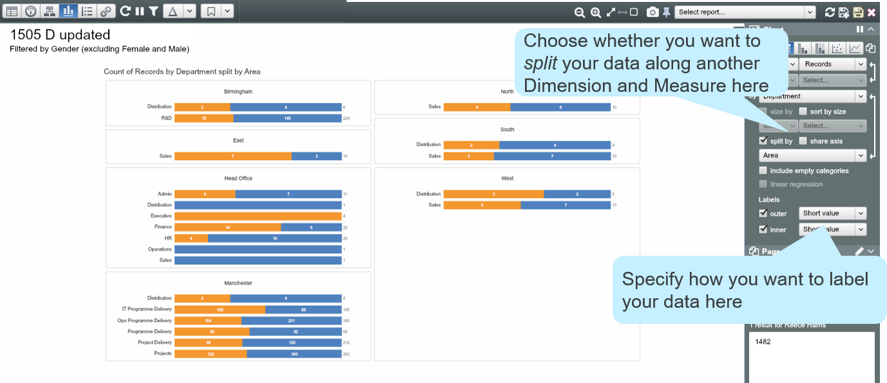
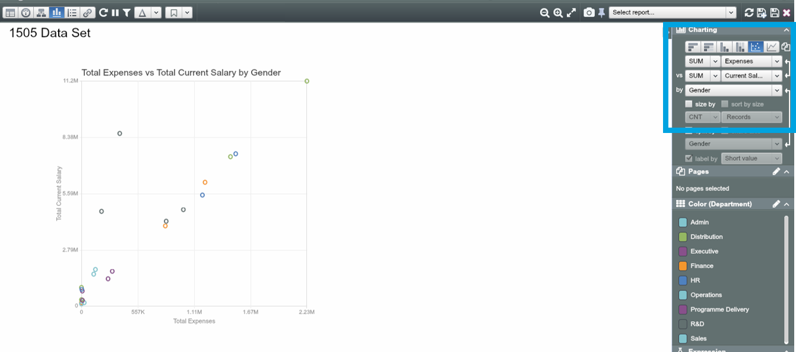
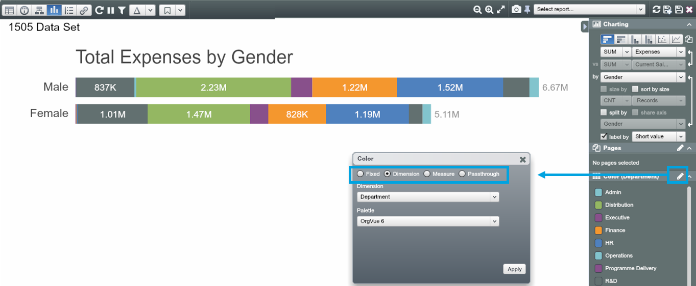

# Charts

##Bar chart

1. In Chart View, define your chart visualisations using the Charting Panel in the Side Panel.
Navigate to Chart View via the Toolbar

2. Select a chart type, e.g. bar chart

3. Choose how you want to aggregate your data (SUM, CNT, or AVG) and which Measure you would like to use

4. Break out your data along a particular text or date Dimension

5. Colour your charts by some property

##Split Bar chart (100%) 

Choose percentage bars to see your data by percentage breakdowns along the Dimensions.

##Scatter plot

Scatter plot is useful when viewing the relationship between 2 measures.

Choose Scatter plot and specify X, Y axis and unit and size of bubbles. 

##Line graph 

Line graph is useful to show the trends in your Dataset.

1. Define the Aggregation, Measure and Dimension from the Side Panel. 

2. To display multiple items (i.e. multiple lines) on a graph, colour by a Dimension.

##Colouring options

Through the Side Panel you can use Colour to give your visualisations extra meaning.

| Option | Function |
| -- | -- |
| ‘Fixed’|Fills the same colour across all members of your Dimension
|
|‘Dimension’|Fills a different colour for each member of your Dimension
|
|‘Measure’|Colours your data by a numerical field (such as “Age”, “Salary”, etc…) 
|
|‘Passthrough’|Allows you to define custom colouring logic for individual values
|

