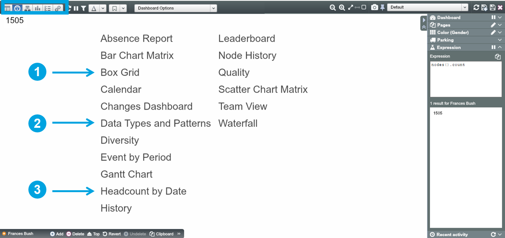
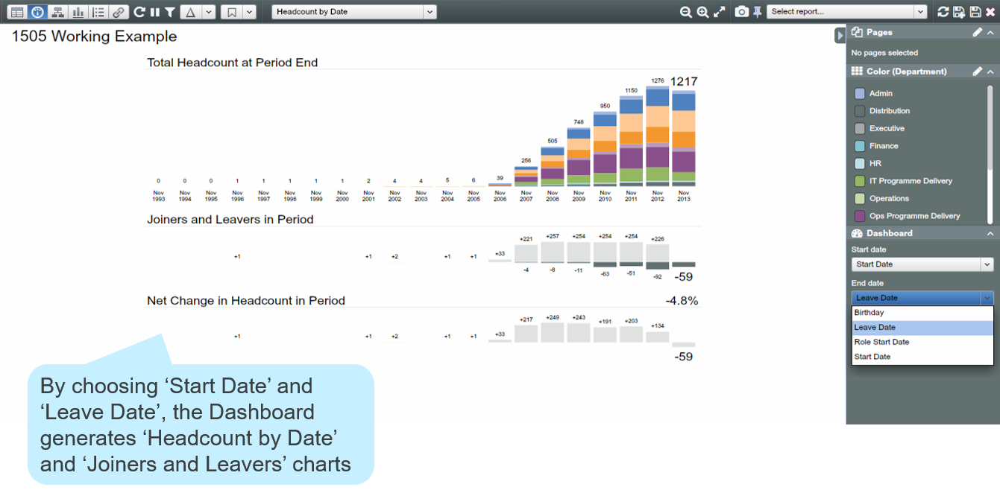

# Dashboards

##Introduction

OrgVue provides standard and bespoke Dashboards depending on license type. Please see our website orgvue.com and Dashboard catalogue (request info@orgvue.com) for fuller descriptions of the available Dashboards. In this chapter, we will  go through 3 standard Dashboards you may use frequently.

You can navigate to Dashboards via the Toolbar.

##'Box Grid'

The ‘Box Grid’ Dashboard is useful for cross-tabulating properties and analysing the values of the properties.

1. In Dashboard View, click ‘Box Grid’ from the Canvas or choose ‘Box Grid from the dropdown list

2. Configure the Dashboard using the Dashboard Panel in the Side Panel. Cross-tabulate by two properties selected here – ‘Columns’ and ‘Rows’, and select an aggregation type for the values

##Data Types and Patterns

As we have already seen, the ‘Data Types and Patterns’ Dashboard allows you to immediately understand data patterns and spot errors in your Dataset.

1. In Dashboard View, choose ‘Data Types and Patterns’ from the dropdown list

2. Configure the Dashboard using the Dashboard Panel in the Side Panel. You can choose properties you want to present on the Dashboard

##Headcount By Date

The ‘Headcount By Date’ Dashboard counts nodes between two different Date Properties.

1. In Dashboard View, choose ‘Headcount By Date’ from the dropdown list

2. Configure the dashboard using the Dashboard Control in the Side Panel. Select the date range to display. All date properties in the Dataset are listed in the ‘Start Date’ and ‘End Date’ drop downs

You can change the ‘Period Length’ and ‘Number of Periods’ to view specific time periods and intervals.

