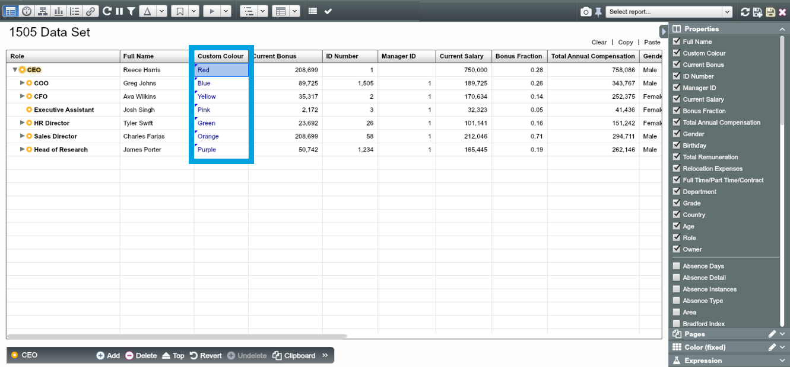
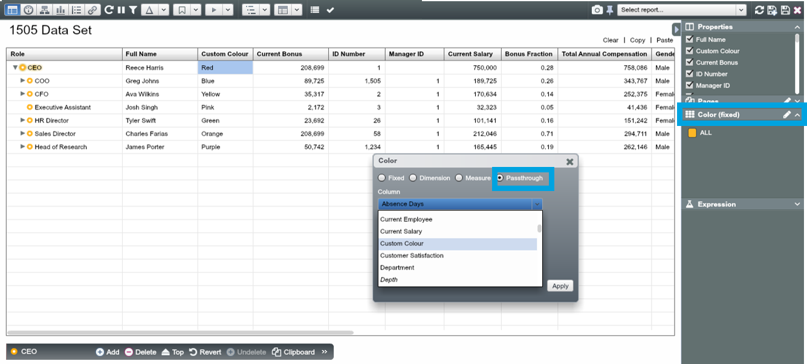

#Custom colour option (‘Passthrough’)

1.
To manually set the colour for each node or group of nodes, first create a new property (in the example below this is called “Custom Colour”)

2.
In that property, enter the name of popular colours, e.g. “Red”, “Blue”, “Orange”. Alternatively use hexadecimal colour codes, e.g. “#FF0000” for Red

3.
Open up ‘Color’ Dialogue, then select the ‘Passthrough’ option and choose “Custom Colour” from the ‘Column’ drop-down list

4.
Notice that OrgVue recognises the spellings of most colours and will the colour you have specified for each node in all Views

**NOTE:** To learn more about custom colour options in OrgVue visit [support.orgvue.com](https://support.orgvue.com/hc/en-us)