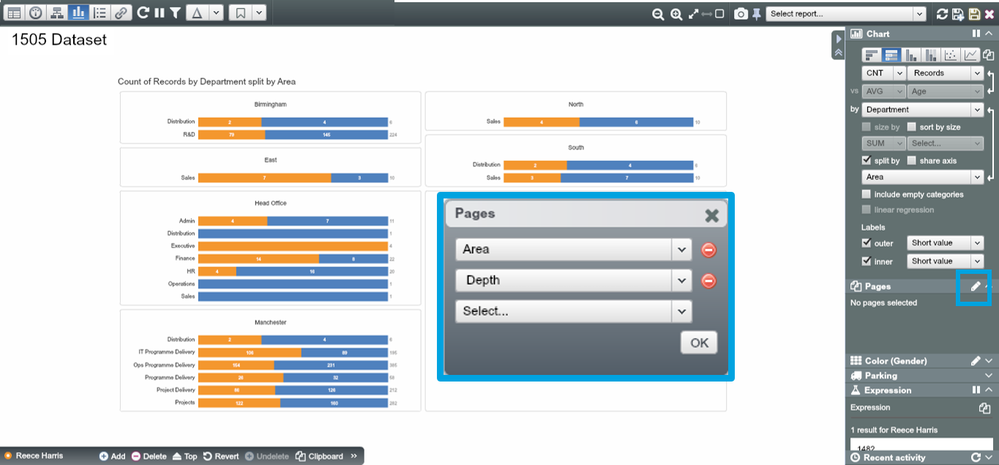
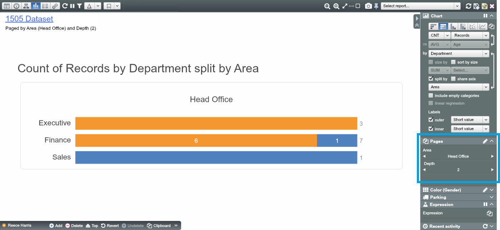
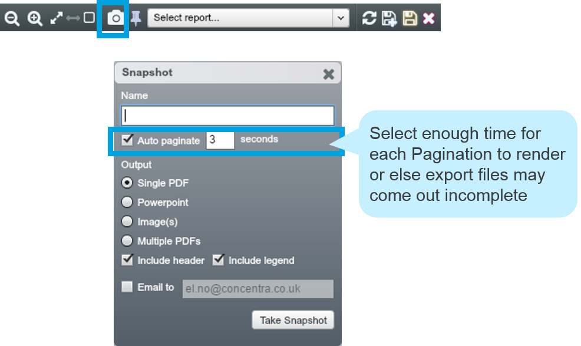
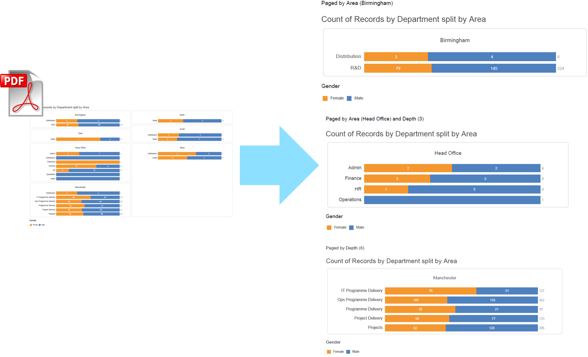

# Pagination

##Adding pages to your Dataset

You can paginate your Charts by any Dimensions or Measures. Pagination works in any Views.

1. Click the 'pencil’ icon on the Pages Panel

2. In the ‘Pages’ Dialogue that appears, choose one or more properties from the dropdown list and click ‘OK’. To remove your Pagination criteria simply click the  icon in the ‘Pages’ Dialogue

##Display

After setting pagination criteria, you can view your sub charts (in Chart View).

Cycle through the different Pages using the left and right arrows under the Pages Panel and see the effects on the visuals. Here “Area: Head Office” and “Depth: 2” will display the results for Depth 2 in Head Office

##Using Auto-Pagination for outputs

OrgVue can save multiple Snapshots by using Auto-Pagination.

1. Click through to the ‘Pages’ Dialogue in the Side Panel

2. Choose single or multiple criteria (properties) from the dropdown list and click ‘OK’
3. Click ‘snapshot’ icon to export your data from OrgVue, and leverage Pagination by ticking ‘Auto paginate’ in the Dialogue

##Auto-Pagination results

Applying autopagination will output a PDF or PPT with each paged OrgVue chart being added to a new sheet.

