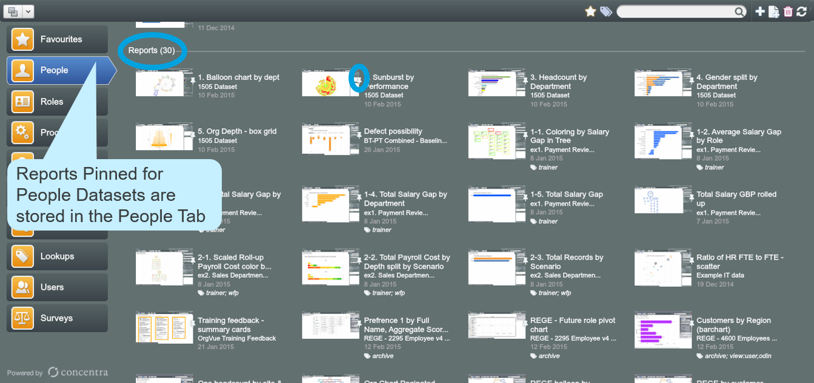

# Pinning

##Saving report to template

You can save a particular Dashboard or Chart for later use by Pinning reports – handy for sharing with other users.

1.
After drawing a chart, click the ‘Pin’ icon to save the chart

2.
In the ‘Save Report’ Dialogue, type a name for the report

3.
Access saved reports from this drop down

**For advanced ways of sharing reports go to [support.orgvue.com](support.orgvue.com)**

All Pinned reports are stored in a ‘Reports’ section on the OrgVue Home screen. You can directly open the Pinned report from there.

