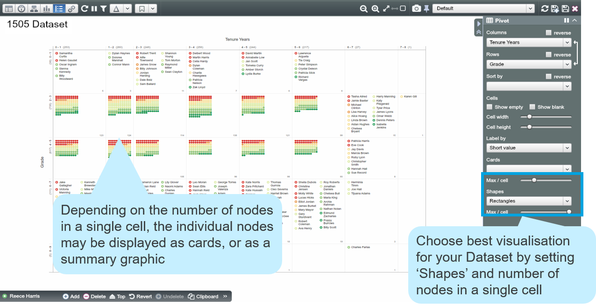

# Pivot View

##Introduction

Pivot View is used for multiple purposes, e.g. understanding data, cleansing data and visualising data.

To generate the visual in the example below:

1. Go to Pivot View

2. In the Pivot Panel in Side Panel, set “Tenure Years” as ‘Columns’, “Grade” as ‘Rows’ and choose Rectangles for ‘Shapes’, then drag the ‘Max / cell’ slider to the right end 

##Various shapes

For summary cells you can select different shapes including circles, pictographs (scaled circles), sunflowers and treemaps (scaled rectangles).

