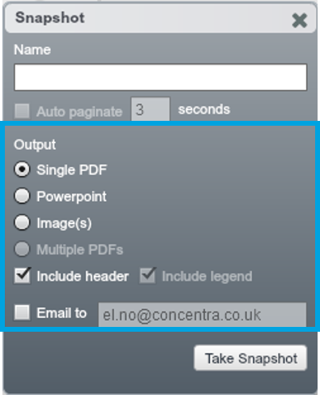

# Snapshot

##Exporting reports

You can export any of your charts in the current View from OrgVue.

1. Click on the ‘camera’ icon on the top right-hand corner of the Toolbar

2. In the ‘Snapshot’ Dialogue simply enter a name for your output file and select whether it will be a PDF, PPT or Image. Then click ‘Take Snapshot’

###Output Options

* You have 3 formats choose from:
  * **PDF** – good quality & infinitely zoomable
  * **PowerPoint** editable objects in PowerPoint
  * **Image** – small size transparent image in PNG

* You can export multiple ‘Pages’ of your Dataset, cut by any Dimensions and Levels you like using OrgVue’s Pagination feature which is located inthe Side Panel (find more about Pagination in the ‘Learn more’ section)

* You can either download and save a copy locally or choose to email it directly to any email address (email will come from donotreply@orgvue.com) 
