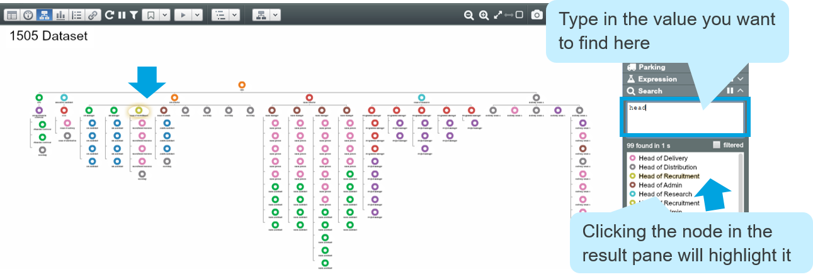
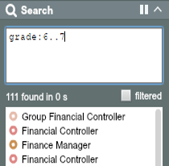

# Search Box (Querying)

##Search and Navigate

Type into the Search Box to search through all properties in the Dataset and find matches. The returned nodes are grouped by the property in which the match occurs. They can be highlighted in Tree View by hovering over or clicking the ‘node’ icons in the Results Pane.

###Navigating Options
1. **Click on** the Label in the results pane to select the node
2. **Over on** the icon to highlight the node
3. **Click on** the icon to centre on the node (**double-click** to zoom in)

##Syntax

You can narrow down your search by using syntax and ticking ‘filtered’. For example:

Use `‘[property name]: [value]’` to search for values in a specific property

Use ‘[x]..[y]’ to search for nodes containing values between x and y

To search nodes meeting multiple criteria, put spaces between your searches

Common operators such as `>`, `<`, `OR`, `AND` also can be used to help your search

**Note**: To learn advanced search visit [support.orgvue.com](support.orgvue.com)
