# Final assessment

##Quiz

###Q1. Which of the following does not apply to OrgVue?

(A): A graph database

(B): Schema-less

(C): Extendable

(D): Desktop application

###Q2. Which of the following tabs cannot be viewed on the left-hand side of the Tenant by those with 'user'-level permissions?

(A): People

(B): Roles

(C): Processes

(D): Favourites

(E): Users

(F): Links

(G): Surveys

###Q3. Choose what you can't do on the Side Panel

(A): Add a new node

(B): Colour by dimensions

(C): Evaluate Expressions

(D): Select/de-select properties displayed

(E): Navigate to quality dashboard

###Q4. Choose the correct observations (in Tree vocab) about the org in the picture**

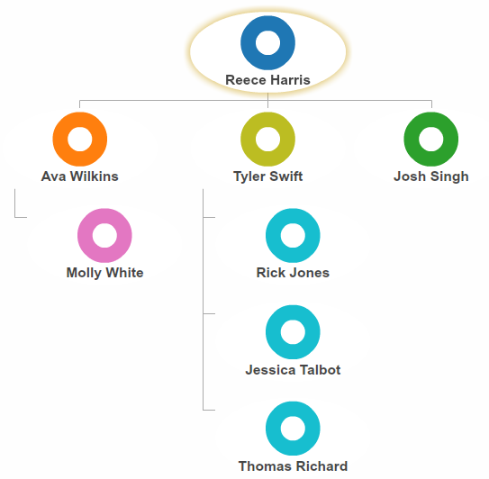

(A): Reece Harris is the root of this org

(B): Ava Wilkins is a parent of one child

(C): Rick Jones and Thomas Richard are siblings

(D): Reece Harris has 3 children and 4 descendants

(E): There are 4 leaves

(F): There are no orphans

###Q5. What can you do with Filter Control?

(A): Identify duplicate nodes

(B): Find all data points that have been changed since the last save

(C): Drag and drop collections of nodes from one Property header to another

(D): See standard deviation of the selected subset of numerical property

###Q6. You want to compare the "Performance Ranking" and "Current Bonus" for all Employees, by department and size the markers in proportion to the number of records in each department, which of the following is most useful?

(A): Scatter Chart

(B): Column Chart

(C): Sunburst

(D): Pivot

(E): Box Grid

(F): Bar Chart Matrix

##Final Exercise: Please answer the questions using OrgVue visualisations

1. Which areas of business (department) need further investigation on low performance?
2. Are there any correlations between large spans of control and performance?(tip: Exclude the nodes with outgoing count = 0)
3. Can we say more engaged employees are better in their performance?
4. How many high performers in Manchester have less than 2 tenure years?
5. Create a new property ‘Team Performance’ using Expressions and see if there are correlations between Team Performance and Team Engagement

##Answers 

###1.
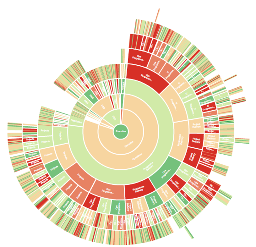

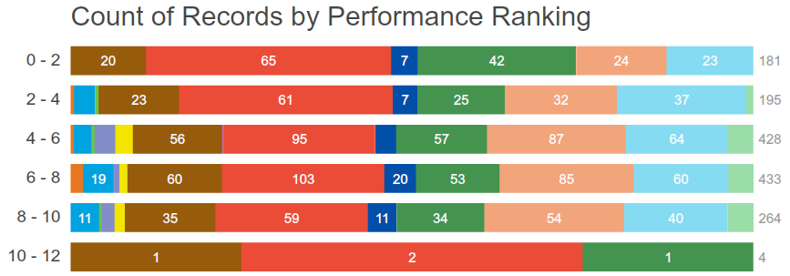
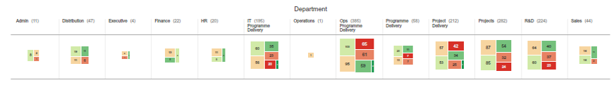
###2.

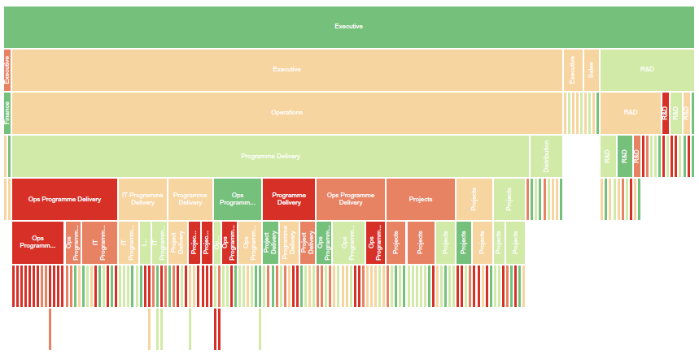

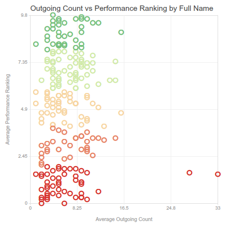
###3.

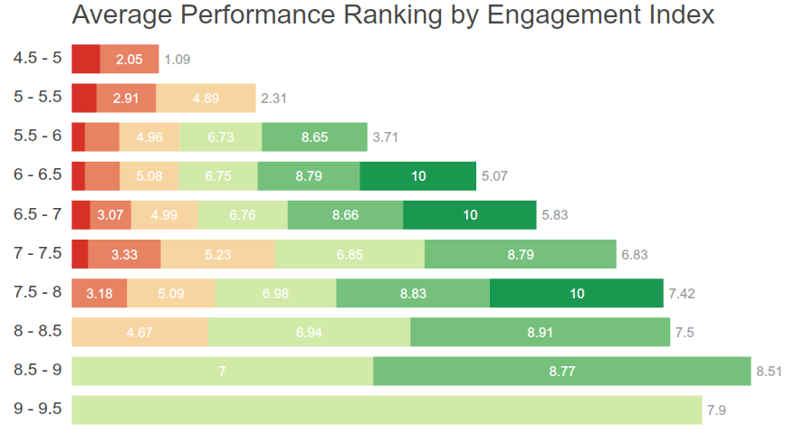

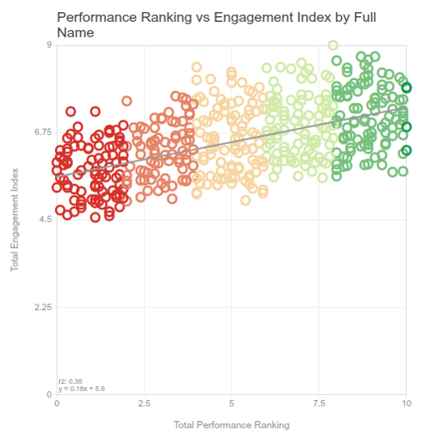
###4.

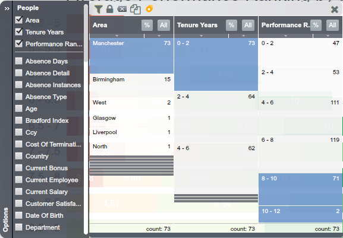

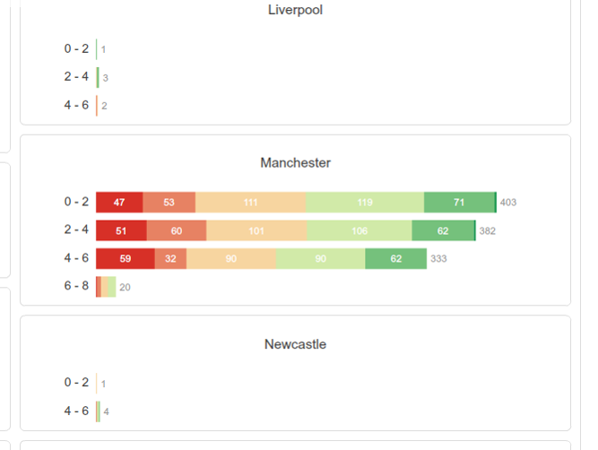
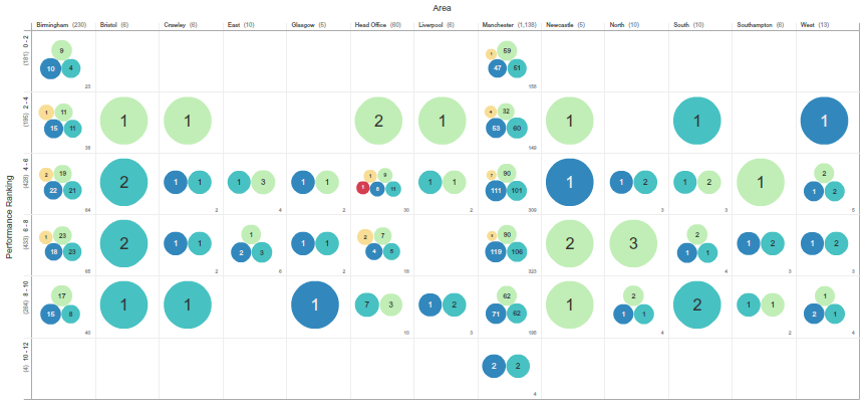

###5.
* Create a new property ‘Team Performance’ using default value box node.d.performanceranking.avg

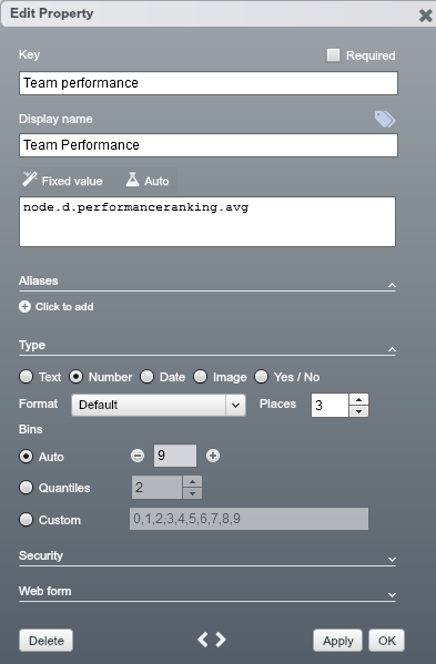

* Scatter chart of AVG Team Performance vs. AVG Team Engagement, coloured by Department dimension

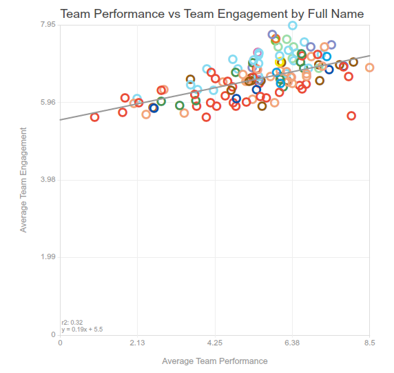
